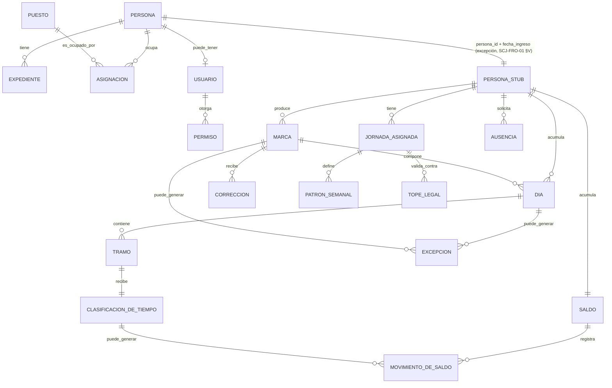

# Modelo conceptual del sistema completo

**Sistema de Control de Jornada**
Folio SCJ-MOD-01 · Versión 1.1 · 2 de septiembre de 2026

> **Cambio de versión (V1.0 → V1.1, menor):** se agrega el estado `revisado` a `día`, el catálogo
> `día_festivo`, la relación `MARCA ||--o{ EXCEPCION` (una excepción también puede originarse en
> una marca, no sólo en un día), y se precisa `movimiento_de_saldo` con su quinto tipo
> (`generado_quincena`) y el atributo `monto`. **Trabajo conjunto — avisar antes de la próxima
> sesión compartida si algo de esto se quiere discutir o revertir.**

Diagrama entidad-relación del sistema completo, incluyendo las entidades del subsistema de Personas
como cajas con sus atributos. **Trabajo conjunto.** Corresponde al entregable E1 de `SCJ-ESP-01`.

---

## I. Alcance del diagrama

Este es el único documento donde aparecen **las entidades de los dos subsistemas**. Sirve para ver
el sistema entero de una vez y para identificar exactamente dónde está la frontera.

Del subsistema de Personas se muestran las entidades y sus atributos, **sin implementación ni
datos**. No es el modelo de ese subsistema: es su silueta.

---

## II. Diagrama

> Fuente en `diagramas/fuente/conceptual.mmd` · Imagen en `diagramas/export/conceptual.svg`

**La frontera en el diagrama.** `PERSONA ||--|| PERSONA_STUB` es la única relación que cruza de un
subsistema al otro, y lleva dos valores: `persona_id` (la regla) y `fecha_ingreso` (la excepción
documentada). Ninguna otra línea del lado Tiempo toca una entidad de Personas.

---

## III. Entidades del subsistema de Personas

Silueta conceptual, sin implementación ni datos. Basada en el modelo de cuatro capas
(persona / puesto / usuario / permiso) y en el esquema anticipado por `SCJ-FRO-01 §II`.

| Entidad | Qué representa | Atributos principales |
|---|---|---|
| **persona** | Identidad civil de la persona física | `id` (uuid), `actualizado_en` (marca de versión: el registro vigente es el de mayor `actualizado_en`), `curp`, `rfc`, `nss`, `primer_nombre`, `segundo_nombre`, `apellido_paterno`, `apellido_materno`, `fecha_nacimiento`, `fecha_ingreso`, `fecha_baja`, `estado` (activo / baja definitiva / suspensión — `fecha_baja` y `estado = baja_definitiva` se sincronizan por función, no pueden discreparse) |
| **expediente** | Documentación laboral y contractual | `persona_id`, `tipo_contrato`, `fecha_firma`, `documento_ref` |
| **puesto** | Casilla del organigrama, puede estar vacante | `nombre`, `área`, `nivel`, `reporta_a_id`, `estado` (actual / vacante / previsto) |
| **usuario** | Credencial de acceso al sistema. Puede no existir para un empleado | `persona_id` (nulo permitido), `nombre_usuario`, `estado` |
| **permiso** | Acción permitida, con nomenclatura de dominio (`almacen.pedido.preparar`) | `código`, `heredable` |
| **asignacion** | Relación persona↔puesto, con vigencia — una persona puede ocupar varios puestos | `persona_id`, `puesto_id`, `vigente_desde`, `vigente_hasta` |

---

## IV. Entidades del subsistema de Tiempo

| Entidad | Qué representa | Atributos principales |
|---|---|---|
| **persona** (stub) | Ancla de la frontera | `persona_id`, `fecha_ingreso` *(excepción documentada, `SCJ-FRO-01 §V`)* |
| **marca** | Instante registrado de identificación, sin tipo | `evento_id`, `persona_id`, `momento_dispositivo`, `origen`, `requiere_revision` |
| **día** | Marcas de una persona en una fecha, con estado | `persona_id`, `fecha`, `estado` (abierto / cerrado / bloqueado / revisado) |
| **día_festivo** | Catálogo de días festivos, para separar el pago de domingo/festivo trabajado | `fecha`, `nombre` |
| **tramo** | Intervalo entre una marca impar y la par siguiente | `dia_id`, `inicio`, `fin` |
| **jornada_asignada** | Qué jornada tuvo la persona, con vigencia | `persona_id`, `vigente_desde`, `vigente_hasta` |
| **patrón_semanal** | Qué días, con qué horario y pausas | `jornada_asignada_id`, `dia_semana`, `horario` |
| **tope_legal** | Máximo semanal y de horas extra, con vigencia | `vigente_desde`, `máximo_semanal`, `máximo_extra` |
| **clasificación_de_tiempo** | Ordinario, reposición o extra, sobre un tramo | `tramo_id`, `tipo` |
| **saldo** | Deuda de horas acumulada de una persona | `persona_id`, `monto` |
| **movimiento_de_saldo** | Genera deuda al corte quincenal, o la resuelve: cubrir, arrastrar, descontar o condonar | `saldo_id`, `tipo` (generado_quincena / cubrir / arrastrar / descontar / condonar), `monto`, `motivo`, `autor` |
| **corrección** | Registro nuevo que apunta a un registro anterior | `registro_original_id`, `valor_corregido`, `motivo`, `autor` |
| **ausencia** | Periodo no trabajado, con naturaleza y autorización | `persona_id`, `naturaleza`, `fecha_inicio`, `fecha_fin`, `estado_autorización` |
| **excepción** | Marca o día apartado para revisión humana | `marca_id` / `dia_id`, `motivo_revision`, `estado` |
| **parámetro** | Valor de regla de negocio, configurable | `clave`, `valor`, `vigente_desde` |

---

## V. La frontera en el diagrama

**Sólo una relación cruza:** `PERSONA ||--|| PERSONA_STUB`, con `persona_id` (la regla) y
`fecha_ingreso` (la única excepción, ver `SCJ-FRO-01 §V`). Ninguna otra entidad de Tiempo se
conecta directamente con una entidad de Personas — todo pasa por el stub.

---

## VI. Desacuerdos y preguntas abiertas

Ninguno pendiente al cierre de esta versión. Ver histórico en `SCJ-PRA-01`.

| # | Pregunta | Quién la levanta |
|---|---|---|
| — | — | — |

---

*Modelo conceptual · Folio SCJ-MOD-01 · V1.0*
