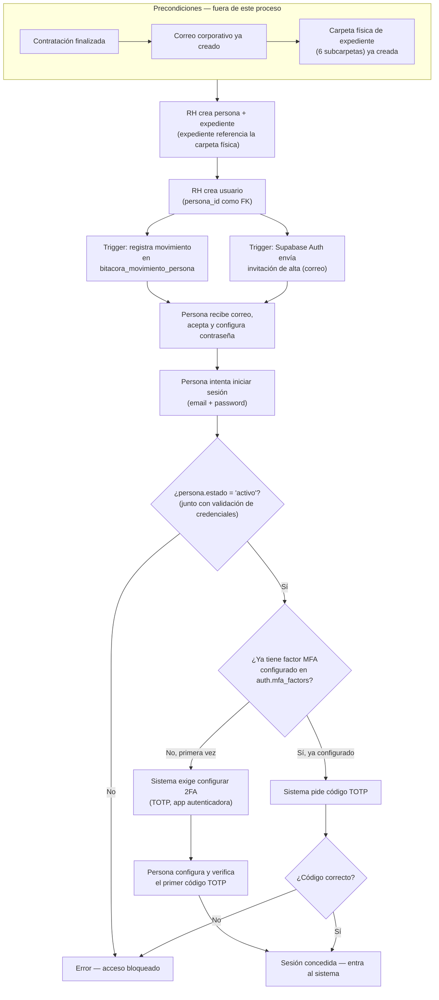

# Proceso — Alta de usuario

**Sistema de Control de Jornada**
Folio SCJ-PRO-01 · Versión 1.0 · 2 de septiembre de 2026

Primer documento de la serie `SCJ-PRO` — procesos del sistema completo, con diagrama de flujo,
diseñados en sesión conjunta de Diego con el usuario del proyecto antes de pasar a implementación.
Este cubre el primer proceso del subsistema **Personas y Usuarios**: el alta de un usuario nuevo.
Movimiento de persona (suspensión, reactivación, baja) queda para un `SCJ-PRO` siguiente.

---

## I. Alcance

**Cubre:** desde que una persona ya contratada necesita acceso al sistema, hasta que entra por
primera vez con su cuenta ya asegurada con 2FA.

**No cubre — son procesos o pasos previos ya resueltos en otro lugar:**

- El proceso de contratación en sí (RH, documentación laboral) — está fuera de este documento.
- La creación de la cuenta de correo corporativo — se asume ya hecha antes de empezar este flujo.
- La carpeta física del expediente (6 subcarpetas) — se genera en la contratación, no aquí. Este
  proceso sólo crea el **registro** de `expediente` en base de datos, que referencia esa carpeta.
- Movimiento de persona (baja, suspensión, reactivación) — próximo `SCJ-PRO`.

---

## II. Precondiciones

Deben cumplirse **antes** de que este proceso pueda arrancar, y no las gestiona este documento:

1. Contratación finalizada.
2. Correo corporativo de la persona ya creado.
3. Carpeta física del expediente (6 subcarpetas, ver `RH-Plantillas/Generador-Expedientes`) ya
   armada — el registro de `expediente` que se crea en este proceso referencia esa carpeta.

---

## III. Diagrama de flujo — estado objetivo

Representa cómo va a operar el sistema terminado (RH crea el usuario desde la app). El estado
actual, interino, se documenta aparte en la sección VI.

---

## IV. Descripción paso a paso

| Paso | Actor | Acción | Toca |
|---|---|---|---|
| A1 | RH | Crea `persona` y `expediente` en una misma operación. `expediente.documento_ref` apunta a la carpeta física ya armada en la precondición | `personas.persona`, `personas.expediente` |
| A2 | RH | Crea `usuario`, con `persona_id` de A1 como FK | `personas.usuario` |
| A3 | Sistema (trigger) | Registra el alta en la bitácora — **no hay bitácora aparte de usuario**, se usa la misma `bitacora_movimiento_persona` porque el usuario va ligado directo a la persona | `bitacora_movimiento_persona` |
| A4 | Sistema (trigger) | Dispara la invitación de alta de Supabase Auth al correo de la persona | Supabase Auth |
| A5 | Persona | Recibe el correo, acepta la invitación y define su contraseña | Supabase Auth |
| L1 | Persona | Intenta iniciar sesión por primera vez | Supabase Auth |
| C1 | Sistema | Valida `persona.estado = 'activo'` **junto con** la validación de credenciales — si la persona no está activa, error, sin importar que la contraseña sea correcta. Esta validación corre en **todo** inicio de sesión futuro, no sólo el primero | `personas.persona.estado` |
| C2 | Sistema | Revisa si ya existe un factor MFA configurado para este usuario | `auth.mfa_factors` |
| M1-M2 | Persona | Sólo la primera vez: configura y verifica un TOTP con su app de autenticación | Supabase Auth MFA |
| M3-C3 | Persona | En logins siguientes: ingresa el código TOTP de su app | Supabase Auth MFA |
| S1 | Sistema | Sesión concedida, entra al sistema | — |

---

## V. Reglas de negocio confirmadas

- **Orden obligatorio: persona + expediente antes que usuario.** `usuario.persona_id` es FK — no
  puede existir un usuario sin la persona ya creada.
- **A3 y A4 son independientes entre sí.** Ninguno espera al otro; ambos se disparan al crear
  `usuario`.
- **Una sola bitácora.** No se crea una bitácora propia de `usuario` — todo movimiento de alta de
  usuario se registra en `bitacora_movimiento_persona`, porque el usuario está ligado directo a la
  persona.
- **El chequeo de `persona.estado = 'activo'` es permanente, no sólo de la primera vez.** Corre en
  cada inicio de sesión, en el mismo paso que la validación de credenciales — antes de llegar
  siquiera al reto de 2FA.
- **2FA obligatorio, sólo TOTP por app de autenticación** (no SMS, no correo). Se exige configurar
  en el primer login y se pide en cada login siguiente. Usa el mecanismo nativo de Supabase
  (`auth.mfa_factors`) — no se replica en tablas propias, mismo patrón ya usado para password.

---

## VI. Estado actual — interino, sin panel construido

El diagrama de la sección III describe el sistema terminado. **Hoy nada de esto tiene interfaz.**
Mientras no exista el panel de RH:

- **A1 y A2 los ejecuta Diego a mano**, con `INSERT` directo en Supabase, respetando el mismo
  orden (persona + expediente primero, usuario después) porque la FK lo exige igual en producción
  que en este estado interino.
- **A3 (bitácora) y A4 (invitación de Supabase)** no tienen trigger automatizado todavía — quedan
  pendientes de programar. Mientras tanto, si se necesita dar de alta a alguien de verdad, Diego
  dispara la invitación manualmente desde el dashboard de Supabase después del `INSERT`.
- El resto del flujo (L1 en adelante) ya corre tal cual está descrito, porque depende de Supabase
  Auth, no de una interfaz propia todavía sin construir.

---

## VII. Siguiente paso

Este documento crece con un `SCJ-PRO` por cada proceso nuevo que se diseñe (movimiento de persona,
altas de otros subsistemas, etc.). Cuando el conjunto de procesos relevantes para un módulo esté
completo, se compila junto con el modelo de datos ya cerrado (`SCJ-MOD`, `SCJ-DEC`) en el plan de
implementación que se entrega al agente encargado de construirlo.

---

*Proceso · Folio SCJ-PRO-01 · V1.0*
