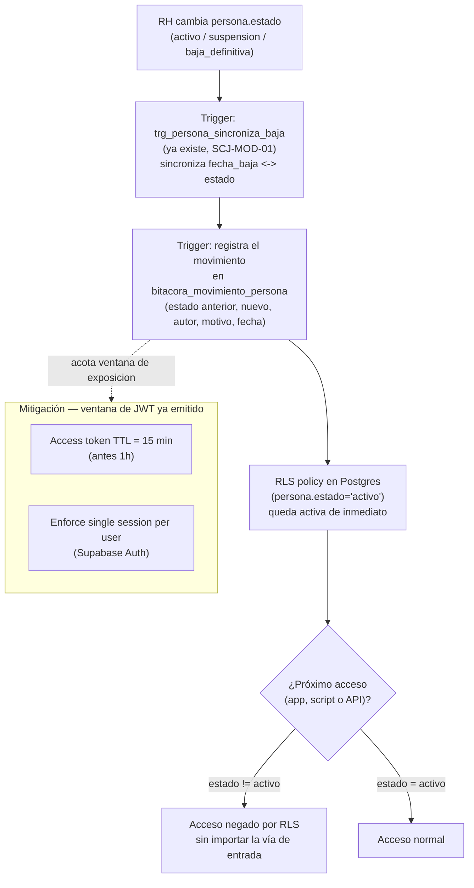

# Proceso — Movimiento de persona

**Sistema de Control de Jornada**
Folio SCJ-PRO-02 · Versión 1.0 · 2 de septiembre de 2026

Segundo documento de la serie `SCJ-PRO`, subsistema **Personas y Usuarios**. Cubre lo que
`SCJ-PRO-01` (alta de usuario) dejó pendiente: qué pasa cuando el `estado` de una persona ya dada
de alta cambia (suspensión, reactivación, baja definitiva), y cómo ese cambio bloquea el acceso al
sistema de forma inmediata y por cualquier vía — no sólo en el login.

---

## I. Alcance

**Cubre:** el cambio de `persona.estado` después del alta, y el bloqueo de acceso que ese cambio
dispara en toda la aplicación (interfaz, scripts, llamadas directas a la API).

**No cubre — son procesos o conceptos ya resueltos en otro lugar:**

- **Cambio de puesto o de área.** No es un movimiento de este proceso. Ya tiene su propio
  histórico en `asignacion` (`vigente_desde`/`vigente_hasta`, fila nueva cierra la anterior) — no
  se duplica en `bitacora_movimiento_persona`.
- **El chequeo de `persona.estado = 'activo'` en el login** — ya quedó establecido en
  `SCJ-PRO-01` (paso C1). Este proceso no lo reimplementa, sólo describe qué lo dispara y cómo se
  extiende a todo acceso, no sólo al login.
- **Alta de persona/usuario** — `SCJ-PRO-01`.

---

## II. Precondiciones

1. Persona y usuario ya dados de alta (`SCJ-PRO-01` completo).
2. `persona.estado` en alguno de sus 3 valores válidos: `activo`, `suspension`,
   `baja_definitiva`.

---

## III. Diagrama de flujo — estado objetivo

---

## IV. Descripción paso a paso

| Paso | Actor | Acción | Toca |
|---|---|---|---|
| B0 | RH | Cambia `persona.estado` a uno de los 3 valores válidos | `personas.persona` |
| T1 | Sistema (trigger existente) | `trg_persona_sincroniza_baja` mantiene la consistencia `estado`/`fecha_baja` — ya construido desde `SCJ-MOD-01`, este proceso no lo modifica | `personas.persona` |
| T2 | Sistema (trigger) | Registra el movimiento en `bitacora_movimiento_persona`: estado anterior, estado nuevo, quién lo hizo, motivo, fecha | `bitacora_movimiento_persona` |
| R1 | Sistema (RLS) | La política `persona.estado = 'activo'` vive en Postgres, no en la app — por eso queda vigente de inmediato para cualquier consulta futura, sin desplegar nada | RLS en tablas sensibles |
| V1 | Sistema | En el siguiente acceso, por cualquier vía (app, script, llamada directa a la API con el JWT del usuario), RLS evalúa `persona.estado` | RLS |
| E1 | Sistema | Si `estado != 'activo'`, acceso negado — parejo para app, terminal o script, porque el candado no vive en el código de la app sino en la base de datos | — |
| M1/M2 | Sistema (config Supabase Auth) | TTL de access token a 15 min + "Enforce single session per user" — acotan la ventana en la que un JWT ya emitido antes de la suspensión sigue siendo válido (JWT es stateless, no se invalida al instante) | Supabase Auth |

---

## V. Reglas de negocio confirmadas

- **Movimiento = sólo cambio de `estado`.** Los 3 valores (`activo`, `suspension`,
  `baja_definitiva`) son los únicos que generan una fila en `bitacora_movimiento_persona`. Cambio
  de puesto/área no es movimiento de persona — vive aparte en `asignacion`, con su propio
  histórico por `vigente_desde`/`vigente_hasta`.
- **El candado va en RLS, no sólo en el login de la app.** Esto es lo que permite que scripts o
  llamadas directas a la API queden bloqueadas igual que la interfaz — no basta con que el usuario
  exista, si `persona.estado != 'activo'` en base de datos, es inútil sin importar por dónde entre.
- **`trg_persona_sincroniza_baja` no cambia.** Este proceso lo usa tal cual quedó en `SCJ-MOD-01`,
  no lo reimplementa.
- **JWT sigue siendo stateless.** Suspender no mata un access token ya emitido hasta que expire o
  se intente refrescar. Se acepta como riesgo residual acotado a la ventana del TTL (15 min), no
  se implementa invalidación forzada de tokens vigentes en este proceso.
- **"Enforce single session per user" es on/off, no límite de N dispositivos.** Al iniciar sesión
  nueva, invalida las sesiones anteriores. No hay límite configurable de número de dispositivos
  nativo en Supabase Auth — se descartó construir esa lógica aparte por no ser necesaria para este
  alcance.

---

## VI. Estado actual — interino, sin panel construido

- **B0 lo ejecuta Diego a mano** (`UPDATE` directo en Supabase), mismo patrón interino que
  `SCJ-PRO-01`.
- **T2 (bitácora) ya tiene trigger automatizado**: `trg_bitacora_sincroniza_persona`
  (`db/ddl/05_personas_estructura.sql:109`) sincroniza `persona.estado`/`fecha_baja` en cada
  `INSERT`. Además, desde `db/ddl/09_personas_bitacora_inmutable.sql` la bitácora es de solo
  inserción de verdad (`UPDATE`/`DELETE` bloqueados incluso para `service_role`).
- **RLS ya está configurado**: `06_personas_rls.sql` (política `solo_caller_activo` vía
  `fn_caller_activo()`) está aplicado en el proyecto Supabase real.
- **TTL de 15 min ya está configurado**: Authentication → Sessions → Access token expiry = 900
  segundos.
- **"Enforce single session per user" sigue apagado — y no es sólo un pendiente**: el proyecto está
  en el plan Free de Supabase, que no permite activar esa opción (requiere plan Pro o superior).
  Queda bloqueado hasta que se actualice el plan, no es una simple casilla por marcar.

---

## VII. Siguiente paso

Con `SCJ-PRO-01` y `SCJ-PRO-02` cerrados, el subsistema **Personas y Usuarios** tiene sus procesos
principales cubiertos. Queda pendiente decidir con el usuario si falta algún proceso más de este
módulo antes de compilar el plan de implementación (`SCJ-MOD` + `SCJ-DEC` + estos `SCJ-PRO`) que se
entrega al agente encargado de construirlo.

---

*Proceso · Folio SCJ-PRO-02 · V1.0*
