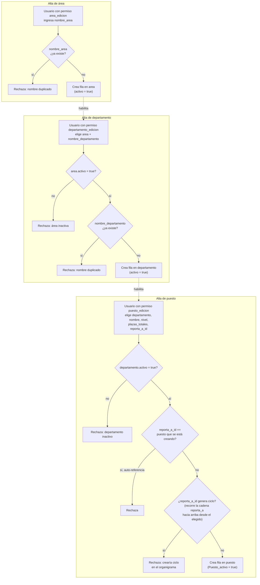

# Proceso — Alta de estructura organizacional (área / departamento / puesto)

**Sistema de Control de Jornada**
Folio SCJ-PRO-03 · Versión 1.0 · 4 de septiembre de 2026

Tercer documento de la serie `SCJ-PRO`, subsistema **Personas y Usuarios** — módulo
Asignaciones/áreas/puestos/permisos. Cubre el alta de los tres catálogos base de la estructura
organizacional: `area`, `departamento`, `puesto`.

---

## I. Alcance

**Cubre:** alta de `area`, alta de `departamento`, alta de `puesto`. Los tres son alta directa
(sin flujo de aprobación de un segundo rol), gateada por el permiso de edición correspondiente
(`area_edicion`, `departamento_edicion`, `puesto_edicion` — no heredables, otorgados vía
`puesto_permiso` al puesto de quien ejecuta el alta).

**No cubre — son procesos o conceptos ya resueltos o pendientes en otro lugar:**

- **Alta de `permiso`.** No es un proceso de usuario. Los permisos se integran a la aplicación al
  diseñar un módulo nuevo — se siembran por migración inicial al subir ese módulo, no se crean
  desde una UI de alta recurrente.
- **Otorgar/revocar permiso a un puesto** (`puesto_permiso` + `bitacora_movimiento_puesto_permiso`)
  — proceso aparte, pendiente de diseñar.
- **Asignación de persona a puesto** (`asignacion`) — proceso aparte, pendiente de diseñar, aunque
  la tabla ya existe con `vigente_desde`/`vigente_hasta`.
- **Baja/desactivación** de área/departamento/puesto — la regla de negocio ya está confirmada (ver
  §V), pero el flujo paso a paso no se cubre en este documento.
- **Edición de `puesto.reporta_a_id`** de un puesto ya existente — la validación de ciclos descrita
  en §III/§V aplica igual ahí, pero el proceso de edición en sí no se documenta aquí.

---

## II. Precondiciones

1. Usuario autenticado con el permiso correspondiente al catálogo que va a crear.
2. Alta de `departamento`: el `area` elegida existe y `activo = true`.
3. Alta de `puesto`: el `departamento` elegido existe y `activo = true`; existe al menos un puesto
   ya creado para elegir como `reporta_a_id` — excepto el puesto tope (Dirección General), que se
   siembra una sola vez fuera de este flujo recurrente.

---

## III. Diagrama de flujo

---

## IV. Descripción paso a paso

| Paso | Actor | Acción | Toca |
|---|---|---|---|
| A0 | Usuario con `area_edicion` | Ingresa `nombre_area` | `personas.area` |
| A1 | Sistema | Valida `nombre_area` único (constraint `UNIQUE` en columna) | `personas.area` |
| A3 | Sistema | Crea fila, `activo = true` | `personas.area` |
| D0 | Usuario con `departamento_edicion` | Elige `area` existente + `nombre_departamento` | `personas.departamento` |
| D1 | Sistema | Rechaza si el área elegida está `activo = false` | `personas.area` |
| D3 | Sistema | Valida `nombre_departamento` único global (constraint `UNIQUE`) | `personas.departamento` |
| D5 | Sistema | Crea fila, `activo = true` | `personas.departamento` |
| P0 | Usuario con `puesto_edicion` | Elige `departamento` existente (obligatorio), `nombre`, `nivel`, `plazas_totales`, `reporta_a_id` (obligatorio salvo el puesto tope) | `personas.puesto` |
| P1 | Sistema | Rechaza si el departamento elegido está `activo = false` | `personas.departamento` |
| P3 | Sistema | Rechaza si `reporta_a_id` apunta al propio puesto que se está creando (auto-referencia) | — |
| P5 | Sistema | Recorre la cadena `reporta_a_id` hacia arriba desde el puesto elegido; rechaza si el puesto nuevo apareciera en esa cadena (ciclo) | `personas.puesto` |
| P7 | Sistema | Crea fila, `Puesto_activo = true` | `personas.puesto` |

---

## V. Reglas de negocio confirmadas

- **`area` es catálogo editable/ampliable**, no cerrado a los 6 valores originales de `RTB-CAT-01`
  — diverge de la decisión previa registrada en `[[diseno-bd-scj-control-jornada]]`. El `CHECK` que
  restringía `nombre_area` a esos 6 valores ya se quitó del diagrama Lucid V2; la columna quedó
  `varchar UNIQUE` libre.
- **Alta directa, sin segunda aprobación.** Quien tiene el permiso de edición del catálogo
  correspondiente puede crear directo — mismo patrón que `SCJ-PRO-01` (alta de usuario).
- **`permiso` no se crea desde este proceso.** Se siembra por migración al integrar un módulo
  nuevo a la aplicación (los permisos quedan cableados a la lógica de ese módulo desde su alta).
- **`departamento.nombre_departamento` es único global**, no sólo dentro de su área.
- **`puesto.departamento` es obligatorio en la práctica** — todo puesto nuevo cuelga de un
  departamento; ninguno cuelga directo del área. (El `FK` ya no acepta `nullable` en el esquema.)
- **`puesto.reporta_a_id` es obligatorio salvo el puesto tope**, que se siembra una sola vez fuera
  de este flujo recurrente.
- **Validación de auto-referencia y de ciclos en `reporta_a_id`** — aplica en el alta y también en
  cualquier edición futura de `reporta_a_id` de un puesto ya existente (la cadena puede romperse
  después si se reasigna a quién reporta un puesto creado previamente). Con el flujo lineal de alta
  (siempre se elige un puesto que ya existe) el ciclo es imposible por construcción en el alta
  misma, pero la validación se implementa de forma general porque sí aplica a edición.
- **`puesto.plazas_totales`** (entero, default 1) reemplaza al enum `estado`
  (`actual`/`vacante`/`previsto`) descartado en esta sesión — evita la ambigüedad de un puesto que
  ya tiene personas asignadas pero sigue necesitando cubrir más plazas. Vacantes se calculan en
  consulta: `plazas_totales - COUNT(asignacion vigente)`, no se guarda como columna.

---

## VI. Estado actual — sin implementar

Ninguna parte de este proceso está construida todavía (ni SQL, ni backend, ni UI) — es diseño puro,
mismo estado que el resto del módulo Asignaciones/áreas/puestos/permisos.

---

## VII. Siguiente paso

Falta diseñar: otorgar/revocar permiso a puesto (`puesto_permiso` +
`bitacora_movimiento_puesto_permiso`), asignación de persona a puesto (`asignacion`), y
baja/desactivación de área/departamento/puesto (regla ya confirmada — sólo se desactiva si no
tiene información asociada activa río abajo — pero sin flujo paso a paso todavía).

---

*Proceso · Folio SCJ-PRO-03 · V1.0*
