# Proceso — Asignación de persona a puesto

**Sistema de Control de Jornada**
Folio SCJ-PRO-04 · Versión 1.1 · 5 de septiembre de 2026

Cuarto documento de la serie `SCJ-PRO`, subsistema **Personas y Usuarios** — módulo
Asignaciones/áreas/puestos/permisos. Cubre cómo una persona queda ligada a un puesto, cómo se
mueve entre puestos, y qué pasa con esa liga cuando la persona cambia de estado.

Es la pieza que conecta los dos lados del módulo: `puesto_permiso` da permisos a un **puesto**, y
`asignacion` es lo único que hace que esos permisos lleguen a una **persona**.

> **Cambió en V1.1 (no contradice V1.0, se agrega sin quitar nada — bump menor):** nueva regla en
> §V, "la asignación al puesto administrador nunca se termina" — ver `T2` en §III/§IV. El §VII de
> este documento sigue describiendo el estado de diseño previo a la implementación real del 4 de
> septiembre de 2026 (nunca se actualizó después, a diferencia de `SCJ-PRO-05`/`06`); esta nota de
> V1.1 no corrige esa desactualización general, sólo documenta la regla nueva — señalado aparte
> para quien decida cerrar esa brecha más adelante.

---

## I. Alcance

**Cubre:** crear una asignación (`asignacion`), terminarla, cambiar de puesto, y el cierre
automático de asignaciones al dar de baja definitiva a una persona.

**No cubre:**

- **Alta de área/departamento/puesto** — `SCJ-PRO-03`.
- **Otorgar/revocar permiso a un puesto** (`puesto_permiso`) — proceso aparte, pendiente.
- **Cambio de `persona.estado`** — `SCJ-PRO-02`. Este proceso sólo describe el efecto de ese
  cambio sobre `asignacion`.

---

## II. Precondiciones

1. Usuario autenticado con permiso `asignacion_edicion`.
2. La persona existe y tiene `estado = 'activo'`.
3. El puesto existe y tiene `Puesto_activo = true`.
4. El puesto tiene al menos una plaza libre:
   `plazas_totales > COUNT(asignacion del puesto con vigente_hasta IS NULL)`.

---

## III. Diagrama de flujo

```mermaid
flowchart TD
    subgraph NUEVA["Asignar a un puesto"]
        N0["Usuario con asignacion_edicion\nelige persona + puesto + vigente_desde"]
        N0 --> N1{"persona.estado = 'activo'?"}
        N1 -->|no| N2["Rechaza: solo personas activas"]
        N1 -->|sí| N3{"Puesto_activo = true?"}
        N3 -->|no| N4["Rechaza: puesto inactivo"]
        N3 -->|sí| N5{"plazas libres?\nplazas_totales - vigentes > 0"}
        N5 -->|no| N6["Rechaza: plazas llenas.\nSubir plazas_totales primero"]
        N5 -->|sí| N7["Crea fila en asignacion\n(vigente_hasta = NULL)"]
        N7 --> N8["La persona hereda los permisos\nde puesto_permiso de ese puesto"]
    end

    subgraph CAMBIO["Cambiar de puesto (transaccional)"]
        C0["Usuario elige la asignación a cerrar\n+ el puesto nuevo + fecha"]
        C0 --> CA{"¿puesto ORIGEN es\nes_administrador_generico?"}
        CA -->|sí| CA2["Rechaza: no se puede sacar\na nadie del puesto administrador"]
        CA -->|no| C1["Valida el puesto nuevo\n(mismas 3 validaciones de arriba)"]
        C1 --> C2{"¿todas pasan?"}
        C2 -->|no| C3["Rechaza — no se cierra nada"]
        C2 -->|sí| C4["TRANSACCIÓN:\ncierra la vieja (vigente_hasta = fecha)\n+ abre la nueva (vigente_desde = fecha)"]
    end

    subgraph TERMINA["Terminar asignación"]
        T0["Usuario elige la asignación vigente"]
        T0 --> T2{"¿puesto.es_administrador_generico?"}
        T2 -->|sí| T3["Rechaza: puesto administrador,\nnunca se le corta la asignación"]
        T2 -->|no| T1["vigente_hasta = fecha\nLa plaza queda libre"]
    end

    subgraph ESTADO["Efecto del cambio de estado (SCJ-PRO-02)"]
        E0["Movimiento en\nbitacora_movimiento_persona"]
        E0 --> E1{"tipo_movimiento"}
        E1 -->|suspension| E2["NO toca asignacion.\nConserva puesto y plaza.\nRLS ya le bloquea el acceso"]
        E1 -->|reactivacion| E3["NO toca asignacion.\nSi venía de suspensión, su\nasignación nunca se cerró"]
        E1 -->|baja_definitiva| E4["Trigger cierra TODAS sus\nasignaciones vigentes\n(vigente_hasta = fecha_efectiva).\nLas plazas se liberan"]
    end
```

---

## IV. Descripción paso a paso

| Paso | Actor | Acción | Toca |
|---|---|---|---|
| N0 | Usuario con `asignacion_edicion` | Elige persona, puesto y `vigente_desde` | `personas.asignacion` |
| N1 | Sistema | Rechaza si `persona.estado != 'activo'` | `personas.persona` |
| N3 | Sistema | Rechaza si el puesto está `Puesto_activo = false` | `personas.puesto` |
| N5 | Sistema | Cuenta asignaciones vigentes del puesto; rechaza si ya alcanzó `plazas_totales` | `personas.asignacion`, `personas.puesto` |
| N7 | Sistema | Crea la fila con `vigente_hasta = NULL` | `personas.asignacion` |
| N8 | Sistema | Desde ese momento la persona tiene los permisos de ese puesto (unión con los de sus otros puestos vigentes) | `puesto_permiso` |
| CA | Sistema | Rechaza cambiar de puesto si el puesto ORIGEN es `es_administrador_generico` (el destino no importa) — V1.1 | `personas.puesto` |
| C0-C4 | Usuario con `asignacion_edicion` | Cambio de puesto: se valida el destino **antes** de cerrar el origen; ambas escrituras van en una transacción | `personas.asignacion` |
| T2 | Sistema | Rechaza terminar la asignación si el puesto es `es_administrador_generico` — V1.1 | `personas.puesto` |
| T0-T1 | Usuario con `asignacion_edicion` | Termina una asignación vigente sin abrir otra | `personas.asignacion` |
| E4 | Sistema (trigger) | Al insertarse un movimiento `baja_definitiva`, cierra todas las asignaciones vigentes de esa persona con `vigente_hasta = fecha_efectiva` | `personas.asignacion` |

---

## V. Reglas de negocio confirmadas

- **Una persona puede tener varias asignaciones vigentes a la vez.** Con 8 personas es común
  cubrir dos roles. Sus permisos son la **unión** de los de todos sus puestos vigentes.
- **`vigente_hasta` se llena en exactamente tres momentos**, nunca por otra razón:
  1. Al terminar una asignación explícitamente.
  2. Al cambiar de puesto (cierra la vieja dentro de la transacción).
  3. Al dar de baja definitiva a la persona (trigger).
- **Suspensión NO cierra asignaciones.** La persona conserva su puesto y su plaza; `RLS` ya le
  bloquea el acceso (`SCJ-PRO-02`). Liberar la plaza permitiría que alguien más la ocupe de forma
  permanente y — por la regla de bloqueo por plazas llenas — la reactivación quedaría atorada
  pidiendo subir `plazas_totales` para regresar a alguien que siempre fue de ahí.
- **Reactivación no genera asignación automática.** Si venía de suspensión, no hace falta: nunca
  se cerró. Si venía de baja definitiva, sí quedó sin puesto y hay que asignarla de nuevo a mano —
  correcto, porque quien regresa puede volver a otro puesto.
- **Reactivar desde `baja_definitiva` está permitido a propósito.** `curp`, `rfc` y `nss` son
  `UNIQUE` en `personas.persona`, así que re-dar de alta a alguien que regresa fallaría por
  duplicado. Reactivar es la única vía limpia, y evita registros duplicados de la misma persona.
- **Plazas llenas bloquean.** No se puede asignar por encima de `plazas_totales`; primero hay que
  subir ese número (permiso `puesto_edicion`). Mantiene el dato honesto en vez de decorativo.
- **Sólo se asigna a personas activas.** Suspendidas y dadas de baja no admiten asignación nueva.
- **Cambiar de puesto es un acto único y transaccional.** El destino se valida antes de cerrar el
  origen; si algo falla no se cierra nada. Nunca queda a medias.
- **`asignacion` no lleva bitácora aparte.** `vigente_desde`/`vigente_hasta` ya son el histórico
  completo — ya establecido en `SCJ-PRO-02 §I`.
- **La asignación al puesto administrador nunca se termina ni se cambia, sin excepción (V1.1).**
  Ni `terminar_asignacion` (`T2`) ni `cambiar_puesto_asignacion` sobre el puesto ORIGEN (`CA`)
  pueden dejar sin asignación vigente al puesto marcado `es_administrador_generico = true`
  (`SCJ-PRO-05 §V`, `SCJ-PRO-06 §V` — misma protección, tres vectores). El destino de un
  `cambiar-puesto` no importa: meter a alguien MÁS en el puesto administrador no es un riesgo,
  sacar al único ocupante sí. Implementado en las dos capas de siempre: `backend/app/routers/
  asignaciones.py` (`_validar_puesto_no_es_administrador_generico`, en ambos endpoints) y RLS
  (`db/ddl/32_puesto_administrador_generico_proteccion.sql` — la policy de `personas.asignacion`
  rechaza cualquier `UPDATE` que deje `vigente_hasta` no nulo para ese puesto; alcanza también a
  `fn_asignacion_cambiar_puesto`, que es `SECURITY INVOKER` y hace el mismo `UPDATE` por dentro).

---

## VI. Cambios que este proceso introduce en piezas ya cerradas

- **Catálogo de permisos: 14 → 16.** Se agregan `asignacion_edicion` y `asignacion_lectura`, no
  heredables. Asignar gente es un acto distinto de definir la estructura (`puesto_edicion`) y de
  repartir permisos (`puesto_permiso_edicion`), y se propaga a lo que esa persona puede hacer.
- **`fn_bitacora_sincroniza_persona` gana una responsabilidad**
  (`db/ddl/05_personas_estructura.sql:86`): además de sincronizar `persona.estado`/`fecha_baja`,
  debe cerrar las asignaciones vigentes cuando el movimiento es `baja_definitiva`. Hoy no lo hace.

---

## VII. Estado actual — sin implementar

Nada de este proceso está construido (ni SQL, ni backend, ni UI). La tabla `personas.asignacion`
tampoco existe todavía en el DDL — sólo está modelada en el diagrama Lucid V2
(`9015128f-275f-4c42-bf86-85eb41a329f6`).

---

## VIII. Siguiente paso

Falta diseñar: otorgar/revocar permiso a puesto (`puesto_permiso` +
`bitacora_movimiento_puesto_permiso`), y baja/desactivación de área/departamento/puesto (regla ya
confirmada en `SCJ-PRO-03 §V`, sin flujo paso a paso todavía). Con eso el módulo queda cubierto y
puede compilarse su plan de implementación.

---

*Proceso · Folio SCJ-PRO-04 · V1.1*
