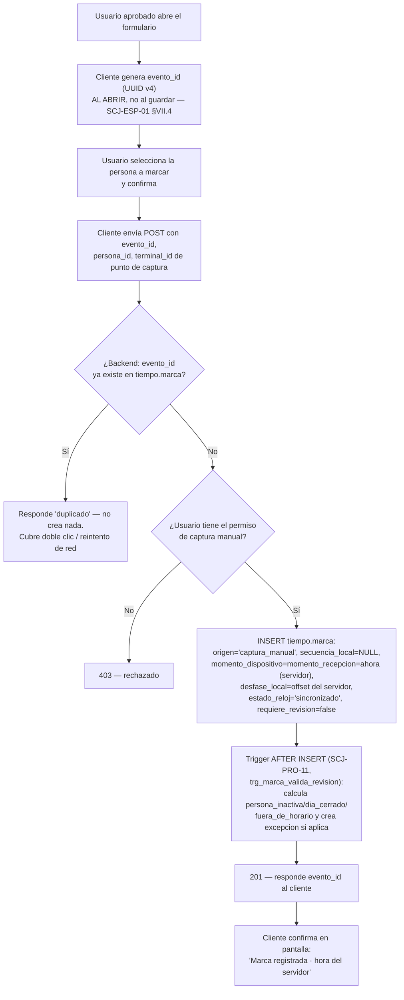

# Proceso — Captura manual de marca

**Sistema de Control de Jornada**
Folio SCJ-PRO-07 · Versión 1.1 · 5 de septiembre de 2026

> **Cambio de versión (V1.0 → V1.1, menor):** el chequeo de `persona_inactiva` que hacía el
> backend antes de insertar (con `requiere_revision` fijado a mano según el resultado) se
> reemplaza por `trg_marca_valida_revision` (`SCJ-PRO-11`) — un disparador centralizado que corre
> sobre cualquier `tiempo.marca`, sin importar el origen. El resultado observable no cambia; sólo
> se dejó de duplicar la misma regla en dos lugares.

Primer documento `SCJ-PRO` del subsistema de **Tiempo** — grupo `Registro-marcas-jornadas-
ausencias-asistencias` del diagrama Lucid. Cubre `origen = captura_manual`
(`SCJ-ESP-01 §IV.2`, `SCJ-CDT-01 §XIII`): la vía por la que marca quien no otorgó consentimiento
biométrico o no logra enrolar por desgaste del dedo. **No es una excepción rara: es una fuente
ordinaria del sistema**, y así se diseña este proceso.

---

## I. Alcance

**Cubre:** desde que un usuario aprobado abre el formulario de captura manual, hasta que la marca
queda en `tiempo.marca` con `origen = 'captura_manual'`, idempotente frente a reintentos.

**No cubre — son procesos o piezas ya resueltas o pendientes en otro lugar:**

- Registro por terminal (`origen = 'terminal'`) — protocolo ya cerrado en `SCJ-CDT-01`, sin
  `SCJ-PRO` propio todavía.
- Corrección de una marca ya registrada (`tiempo.correccion`) — un ajuste **posterior**, distinto
  de la captura manual, que registra algo que ya está ocurriendo. Ver `SCJ-DEC-03`.
- Cierre del día, armado de `tramo` y generación de `excepcion` por paridad — batch pendiente de
  diseñar (ver `SCJ-PRA-01`).

---

## II. Precondiciones

1. La persona a marcar ya existe en `tiempo.persona` (sincronizada desde `personas.persona`) y
   está activa.
2. Quien captura tiene una sesión válida y el permiso `captura_manual_edicion` — confirmado con el
   usuario 2026-09-05, **NO heredable** (a diferencia de `alta_personas_usuarios`). Lo tienen hoy
   `Gerente General`, `Responsable de Recursos Humanos` y `Gerente o Encargado de TI`
   (`db/ddl/33_permiso_tiempo_migracion_inicial.sql`, `34_puesto_permiso_tiempo_mapeo_inicial.sql`
   — ver `SCJ-PRA-01 #04`, resuelta).
3. Existe un `terminal_id` de punto de captura para identificar de dónde salió la marca (no es un
   aparato físico — `SCJ-ESP-01 §VII.1` permite que `terminal_id` identifique "el aparato o el
   punto de captura"). Candidato: un valor fijo por estación de RH, ej. `rh-captura-01`.

---

## III. Diagrama de flujo — estado objetivo

---

## IV. Descripción paso a paso

| Paso | Actor | Acción | Toca |
|---|---|---|---|
| A1 | Usuario aprobado | Abre el formulario de captura manual | — |
| A2 | Cliente (frontend) | Genera `evento_id` **al abrir el formulario**, no al dar guardar — es la llave de idempotencia; si RH reintenta tras no ver respuesta, reenvía el mismo `evento_id` en vez de generar uno nuevo | — |
| A3 | Usuario | Selecciona la persona a marcar de un buscador/directorio y confirma | `personas.persona` (sólo lectura, vía `persona_id`) |
| A4 | Cliente | Envía `evento_id`, `persona_id`, `terminal_id` (punto de captura) al backend. **No envía hora** — la captura el servidor | — |
| B1 | Backend | Busca `evento_id` en `tiempo.marca` (`uq_marca_evento_id`) | `tiempo.marca` |
| B2 | Backend | Si ya existe, responde `duplicado` sin insertar — reintento seguro | — |
| B3 | Backend | Valida el permiso de captura manual del usuario que llama (patrón `requiere_permiso(...)`, `backend/app/permisos.py`) | `personas.puesto_permiso`, `.asignacion` |
| B4 | Backend | Sin permiso, `403` | — |
| D1 | Backend | `INSERT` con `origen='captura_manual'`, `secuencia_local=NULL` (ese contador es del terminal), `momento_dispositivo` y `momento_recepcion` = hora del servidor al capturar (misma marca de tiempo, tomada una sola vez), `desfase_local` = desfase vigente del servidor, `estado_reloj='sincronizado'` siempre (es el reloj del servidor, no el de un aparato remoto), `version_software` = versión de la app web, `requiere_revision=false` — el trigger decide si cambia | `tiempo.marca` |
| E1 | Sistema (trigger `trg_marca_valida_revision`, `SCJ-PRO-11`) | Calcula `persona_inactiva`/`dia_cerrado`/`fuera_de_horario` (el mismo cálculo centralizado que usa el flujo de terminal) y crea `tiempo.excepcion` si aplica — la evidencia de que alguien marcó nunca se descarta, sólo se señala | `tiempo.excepcion` |
| F1 | Backend | Responde `201` con el `evento_id` (eco, útil para que el cliente confirme qué se guardó) | — |
| G1 | Cliente | Muestra confirmación con la hora que puso el servidor — nunca la que el usuario haya podido escribir | — |

---

## V. Reglas de negocio confirmadas

- **`evento_id` nace al abrir el formulario, no al guardar** (`SCJ-ESP-01 §VII.4`). Es lo que
  vuelve segura la práctica real: RH llena el formulario, da guardar, no ve respuesta, vuelve a dar
  guardar — sin este orden esa persona termina con dos marcas a la misma hora, y como las marcas se
  emparejan por paridad, eso corre el día entero.
- **La hora la toma el sistema al capturar. Nadie la escribe a mano.** Es lo que distingue una
  captura manual de un ajuste — un ajuste corrige después un dato que salió mal; la captura manual
  registra en el momento algo que sí está ocurriendo, porque la persona está ahí parada.
- **No es una excepción rara, es una vía ordinaria y permanente**, sin consecuencia alguna para
  quien la use — no hay penalización ni marca especial visible a la persona por usarla.
- **`secuencia_local` siempre `NULL`** en captura manual — ese contador pertenece al terminal físico
  (`ck_marca_secuencia_solo_terminal`).
- **`estado_reloj` siempre `'sincronizado'`** — no hay reloj de aparato remoto que pueda derivar;
  el servidor confía en su propio reloj. Consecuencia: `requiere_revision` por captura manual nunca
  se dispara por reloj — sólo por `persona_inactiva`, `dia_cerrado` o `fuera_de_horario`, los tres
  calculados por `trg_marca_valida_revision` (`SCJ-PRO-11`).
- **`origen` es exactamente 2 valores** (`terminal` / `captura_manual`) — no existe un tercero.
  `SCJ-CDT-01 V2.0`/`SCJ-ESP-01 V2.0` corrigieron una divergencia del modelo lógico que había
  introducido `contingencia` sin respaldo (ver bitácora 2026-09-05).
- **`capturista_id` no vive en Tiempo.** Quién de RH ejecutó la captura se registra en la bitácora
  del esquema Operación, ligado por `evento_id` — fuera del alcance de este repositorio
  (`SCJ-ESP-01 §I.4` regla 4). El backend puede loguearlo donde corresponda, pero no en
  `tiempo.marca` ni en ninguna tabla de Tiempo.
- **La evidencia nunca se pierde por un error del sistema** — si la persona resulta inactiva, la
  marca se inserta igual y se señala, no se rechaza (`SCJ-CDT-01 §II.5`).

---

## VI. Estado actual — nada construido todavía

Este es el primer documento de proceso del subsistema de Tiempo. **Nada de esta sección tiene
código.** Antes de implementar hace falta, en este orden:

1. ~~Confirmar código del permiso~~ — hecho 2026-09-05: `captura_manual_edicion`, no heredable
   (`db/ddl/33_permiso_tiempo_migracion_inicial.sql`, `34_puesto_permiso_tiempo_mapeo_inicial.sql`).
2. Backend: router `tiempo`/`marcas` (no existe — el backend hoy sólo cubre Personas y Estructura
   Organizacional), endpoint `POST /api/marcas/captura-manual`, gateado con
   `requiere_permiso('captura_manual_edicion')`.
3. RLS de `tiempo.marca`/`tiempo.excepcion` — hoy no existen (`db/ddl/` no tiene ningún
   `NN_tiempo_rls.sql`). Sin esto, el mismo hallazgo de seguridad de `31_personas_rls_permiso_
   especifico.sql` aplica aquí: si el router usa `get_caller_client`, la policy es la autorización
   real, no un respaldo.
4. Frontend: formulario de captura manual, con buscador de persona y `evento_id` generado al montar
   el componente (no al enviar).

---

## VII. Siguiente paso

Con este proceso documentado, el subsistema de Tiempo tiene su primer `SCJ-PRO`. Falta al menos:
registro por terminal, cierre de día (paridad → tramo → excepción), corte quincenal
(`generado_quincena`), batch de `dia` para jornada `de_confianza`, y el flujo de aprobación de
ausencias que resuelve el aprobador contra `personas.puesto_permiso` (`SCJ-DEC-05`). Cuando el
conjunto esté completo, se compila junto con `SCJ-MOD-02`/`SCJ-DEC-*` en el plan de implementación,
mismo patrón que se siguió para Personas y Estructura Organizacional.

---

*Proceso · Folio SCJ-PRO-07 · V1.0*
