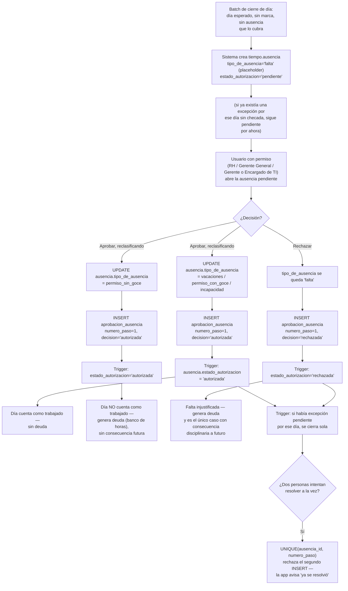

# Proceso — Detección y resolución de falta

**Sistema de Control de Jornada**
Folio SCJ-PRO-08 · Versión 1.0 · 5 de septiembre de 2026

Segundo `SCJ-PRO` del subsistema de **Tiempo**. Cubre el único flujo de `tiempo.ausencia` que existe
hoy: el sistema detecta un día laboral completo sin ninguna marca y sin ausencia previa que lo
cubra, genera la solicitud automáticamente, y un usuario autorizado la resuelve.

> **Por qué no hay solicitud manual todavía.** Vacaciones, permiso o incapacidad solicitados por
> la propia persona son procesos que entran cuando el sistema se aplique a la empresa real — hoy
> no hay ningún flujo para que alguien pida una ausencia. Lo único que existe es la detección
> automática de un día no trabajado. Ver `SCJ-PRA-01` para lo que queda pendiente de esa parte.

---

## I. Alcance

**Cubre:** desde que el batch de cierre de día detecta un día sin trabajar y sin cubrir, hasta que
`tiempo.ausencia` queda resuelta (`autorizada` o `rechazada`) y su excepción asociada, si la había,
se cierra sola.

**No cubre — son procesos o piezas pendientes en otro lugar:**

- Solicitud manual de ausencia (vacaciones/permiso/incapacidad pedidos por la propia persona) —
  no existe todavía, entra con la implementación real.
- Saldo de vacaciones por antigüedad, traslape de ausencias entre personas del mismo grupo,
  `documento_ref` (evidencia cargada) — `SCJ-ESP-01 §VI.8` los exige, pero no aplican mientras no
  haya solicitud manual. Anotados en `SCJ-PRA-01`.
- El batch de cierre de día en sí (qué recorre, cuándo corre, cómo arma `tramo`) — pendiente de
  diseñar aparte. Este documento sólo fija **la regla puntual** que ese batch debe seguir cuando
  encuentra un día sin cubrir (§III, paso A1).
- Corte quincenal (`generado_quincena`) — pendiente de diseñar. Este proceso no escribe nada
  directo en `movimiento_de_saldo`; la deuda de una falta/permiso_sin_goce aparece sola ahí (§V).

---

## II. Precondiciones

1. Existe `patron_semanal` vigente para la persona, para saber que ese día se esperaba trabajo.
2. El día no es domingo ni festivo (`tiempo.dia_festivo`) — esos se filtran antes, nunca generan
   ausencia por sí solos.
3. Quien resuelve tiene permiso `ausencia_edicion` (y, al insertar la aprobación,
   `aprobacion_ausencia_edicion`) — hoy sólo `Gerente General`, `Responsable de Recursos Humanos` y
   `Gerente o Encargado de TI` (`db/ddl/33_permiso_tiempo_migracion_inicial.sql`,
   `34_puesto_permiso_tiempo_mapeo_inicial.sql`). Los tres pueden resolver cualquier caso — no hay
   jerarquía de pasos para este flujo.

---

## III. Diagrama de flujo — estado objetivo

---

## IV. Descripción paso a paso

| Paso | Actor | Acción | Toca |
|---|---|---|---|
| A1 | Sistema (batch de cierre de día) | Encuentra un día que `patron_semanal` esperaba trabajado, sin ninguna `marca`, sin `ausencia` previa que lo cubra, y que no es domingo ni festivo | `tiempo.dia`, `tiempo.patron_semanal`, `tiempo.dia_festivo` |
| A2 | Sistema | Crea `tiempo.ausencia` con `tipo_de_ausencia='falta'` (placeholder, no sabe la razón real todavía), `estado_autorizacion='pendiente'` | `tiempo.ausencia` |
| B1 | Usuario aprobado | Ve la ausencia pendiente y decide | — |
| C1 | Usuario | Tres desenlaces posibles (D/E/F) | — |
| D1-D4 | Usuario / Sistema | Reclasifica a un tipo pagado (`vacaciones`/`permiso_con_goce`/`incapacidad`), aprueba — día neutro, sin deuda | `tiempo.ausencia`, `tiempo.aprobacion_ausencia` |
| E1-E4 | Usuario / Sistema | Reclasifica a `permiso_sin_goce`, aprueba — día no neutro, genera deuda, sin consecuencia futura | `tiempo.ausencia`, `tiempo.aprobacion_ausencia` |
| F1-F4 | Usuario / Sistema | Rechaza — `tipo_de_ausencia` se queda `falta`, genera deuda y consecuencia disciplinaria a futuro | `tiempo.ausencia`, `tiempo.aprobacion_ausencia` |
| G1 | Sistema (trigger) | `trg_ausencia_resuelve_excepcion` cierra sola cualquier `excepcion` pendiente de ese día — reacciona tanto a `autorizada` como a `rechazada` (corregido en esta sesión) | `tiempo.excepcion` |
| H1-H2 | Sistema | Si dos usuarios intentan resolver la misma ausencia a la vez, `UNIQUE(ausencia_id, numero_paso)` deja pasar sólo al primero | `tiempo.aprobacion_ausencia` |

---

## V. Reglas de negocio confirmadas

- **El sistema crea la ausencia, nadie la solicita.** Hoy es la única fuente de `tiempo.ausencia`.
- **`tipo_de_ausencia='falta'` es el estado inicial, no una acusación.** Sólo se confirma como falta
  real (injustificada) si se rechaza. Reclasificar es parte normal de resolver, no una excepción al
  proceso.
- **Un solo paso de aprobación, sin jerarquía.** Cualquiera de los tres puestos con el permiso
  puede resolver cualquier ausencia pendiente — no hay cadena RH→Dirección para este flujo (a
  diferencia de lo que anticipaba `SCJ-DEC-05` para flujos multi-paso futuros).
- **La fila de `aprobacion_ausencia` se crea en el momento de resolver, no antes.** No hay fila
  "pendiente" pre-creada esperando a alguien — evita tener que decidir de antemano quién es "el"
  aprobador cuando en realidad puede ser cualquiera de los tres.
- **Reclasificar el tipo es parte de la misma transacción que aprobar.** `UPDATE
  tiempo.ausencia.tipo_de_ausencia` + `INSERT tiempo.aprobacion_ausencia` no pueden quedar
  separados — si uno falla, el otro tampoco se aplica.
- **La deuda nunca la escribe este proceso directamente.** `vacaciones`/`permiso_con_goce`/
  `incapacidad` cuentan como trabajado; `permiso_sin_goce`/`falta` no — la diferencia la recoge sola
  el corte quincenal (`generado_quincena`, pendiente de programar) al comparar horas esperadas
  contra contabilizadas. No existe un tipo de `movimiento_de_saldo` para "ausencia individual".
- **`permiso_sin_goce` y `falta` (rechazada) generan la misma deuda — la diferencia es sólo la
  etiqueta.** `permiso_sin_goce` no tiene consecuencia futura; `falta` (rechazada) es, por ahora, el
  único caso pensado para eventualmente disparar algo disciplinario — no construido, sólo la
  distinción ya queda hecha en el dato.
- **Un rechazo también cierra la excepción asociada.** Corregido en esta sesión —
  `trg_ausencia_resuelve_excepcion` sólo reaccionaba a `autorizada`; una falta rechazada dejaba la
  excepción abierta para siempre aunque ya hubiera una decisión humana tomada.

---

## VI. Estado actual — nada construido todavía

Sólo el trigger de excepción está corregido (`db/ddl/02_tiempo.sql`,
`fn_ausencia_resuelve_excepcion`). Falta, en orden:

1. El batch de cierre de día en sí (A1-A2) — no existe, es el mismo pendiente de siempre
   (`clasificacion_de_tiempo.tipo`, armado de `tramo`, `dia.estado`, ahora también la creación de
   `ausencia`).
2. Backend: endpoint para listar ausencias pendientes y resolverlas (`PATCH` con la reclasificación
   + decisión en una transacción), gateado con `ausencia_edicion`/`aprobacion_ausencia_edicion`.
3. RLS de `tiempo.ausencia`/`tiempo.aprobacion_ausencia`/`tiempo.excepcion` — no existen todavía.
4. Frontend: bandeja de ausencias pendientes, con el control de reclasificar + aprobar/rechazar.

---

## VII. Siguiente paso

Con `SCJ-PRO-07` (captura manual) y `SCJ-PRO-08` (este) escritos, el subsistema de Tiempo tiene 2
de los ~6 procesos identificados. Siguen: asignación de jornada, corrección de marca, registro por
terminal, y los batches de cierre de día / corte quincenal que varios `SCJ-PRO` ya dan por
existentes sin haberlos diseñado todavía.

---

*Proceso · Folio SCJ-PRO-08 · V1.0*
