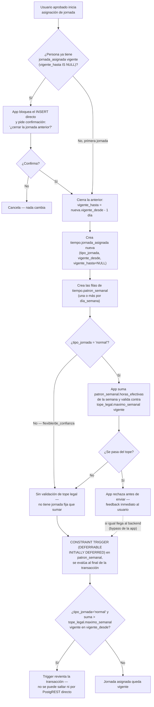

# Proceso — Asignación de jornada

**Sistema de Control de Jornada**
Folio SCJ-PRO-09 · Versión 1.0 · 5 de septiembre de 2026

Tercer `SCJ-PRO` del subsistema de **Tiempo**. Cubre cómo se le asigna a una persona su
`jornada_asignada`/`patron_semanal` — de alta inicial y en cada cambio posterior.

---

## I. Alcance

**Cubre:** desde que una persona ya tiene puesto asignado (`SCJ-PRO-04`), hasta que queda con una
`jornada_asignada` vigente y su `patron_semanal` completo, validada contra el tope legal cuando
aplica.

**No cubre — son procesos o piezas ya resueltas o pendientes en otro lugar:**

- Cómo se calcula `clasificacion_de_tiempo.tipo` u otros efectos de la jornada sobre el día
  trabajado — pendiente de diseñar aparte.
- El batch que crea `tiempo.dia` directo para `de_confianza` — pendiente de diseñar aparte. Este
  documento sólo fija que `de_confianza` no pasa por la validación de tope legal al asignarse.
- Corrección retroactiva de una jornada ya vigente — no existe, el único mecanismo de cambio es
  cerrar y abrir (§V).

---

## II. Precondiciones

1. La persona ya tiene `puesto` asignado (`SCJ-PRO-04`) — la asignación de jornada es el paso
   siguiente en el alta, pero es un paso independiente, no atado al mismo formulario.
2. Quien asigna tiene permiso `jornada_asignada_edicion`/`patron_semanal_edicion` — hoy
   `Gerente General`, `Responsable de Recursos Humanos`, `Gerente o Encargado de TI`
   (`db/ddl/33_permiso_tiempo_migracion_inicial.sql`,
   `34_puesto_permiso_tiempo_mapeo_inicial.sql`), los mismos tres del resto del módulo.
3. Existe `tope_legal` vigente para la fecha de asignación (necesario para validar `normal`).

---

## III. Diagrama de flujo — estado objetivo

---

## IV. Descripción paso a paso

| Paso | Actor | Acción | Toca |
|---|---|---|---|
| A1-A2 | Usuario aprobado | Inicia la asignación; el sistema revisa si ya hay una vigencia activa | `tiempo.jornada_asignada` |
| B1-B3 | Usuario | Si ya había una vigente, confirma o cancela el cierre | — |
| C1 | Sistema | Cierra la vigencia anterior (`vigente_hasta = nueva.vigente_desde - 1`) — nunca coexisten dos vigentes de la misma persona | `tiempo.jornada_asignada` |
| C2-C3 | Usuario | Crea la nueva `jornada_asignada` y su `patron_semanal` completo | `tiempo.jornada_asignada`, `tiempo.patron_semanal` |
| D1-D4 | App | Sólo para `normal`: suma horas de la semana, valida contra `tope_legal.maximo_semanal` vigente en `vigente_desde`, rechaza antes de enviar si se pasa — feedback inmediato, no sustituye al trigger | `tiempo.tope_legal` |
| E1 | — | `flexible`/`de_confianza` no pasan por esta validación — no tienen jornada fija que sumar contra un tope | — |
| F1-F3 | Sistema (trigger) | Respaldo real e insaltable: `CONSTRAINT TRIGGER DEFERRABLE INITIALLY DEFERRED` sobre `patron_semanal`, evaluado al final de la transacción (no fila por fila, para no romper con las N filas del patrón a medio insertar) | `tiempo.patron_semanal` |
| G1 | — | Jornada queda vigente | `tiempo.jornada_asignada` |

---

## V. Reglas de negocio confirmadas

- **Nunca coexisten dos vigencias activas de la misma persona.** Antes de crear una nueva, si hay
  una con `vigente_hasta IS NULL`, la app bloquea el `INSERT` directo y exige confirmación explícita
  para cerrarla — no se cierra silenciosamente.
- **El cierre automático usa `vigente_hasta = nueva.vigente_desde - 1 día`** — sin hueco, sin
  traslape, mismo patrón que el resto de las vigencias del proyecto (`SCJ-DEC-04`).
- **Todo cambio exige cerrar y abrir, nunca editar en el lugar** — incluido cambiar de tipo
  (`normal`→`flexible`, etc.). Es el mismo mecanismo de los pasos A2-C2, no un caso especial.
  Consistente con el requisito duro de `SCJ-ESP-01 §VI.3`: el cálculo de un periodo pasado debe dar
  el mismo resultado indefinidamente aunque la jornada haya cambiado después.
- **El banco de horas no se toca al cambiar de tipo.** El saldo pasa intacto — cambiar de `normal`
  a `flexible` (o viceversa) no resetea ni recalcula la deuda acumulada.
- **La validación de tope legal sólo aplica a `normal`.** `flexible` y `de_confianza` no tienen
  jornada fija que sumar contra `tope_legal.maximo_semanal` — quedan fuera de esta verificación por
  diseño, no por omisión.
- **La validación de tope legal vive en dos capas, a propósito.** La app valida antes de enviar
  (feedback inmediato, mejor experiencia); el `CONSTRAINT TRIGGER` en la base es el que de verdad
  no se puede saltar — mismo problema que ya se encontró con `puesto_permiso`
  (`31_personas_rls_permiso_especifico.sql`): cualquiera con la anon key puede pegarle directo a
  PostgREST sin pasar por el backend. Esto es cumplimiento legal (horas máximas), no una comodidad
  de UX, por eso se refuerza en la base y no sólo en la app — a diferencia de la validación de
  traslape de vigencias (`SCJ-DEC-04`), que sí se dejó únicamente en la aplicación porque ahí el
  costo de un traslape colado es mucho menor que el de una jornada ilegal.
- **`DEFERRABLE INITIALLY DEFERRED`, no `AFTER EACH ROW` inmediato** — el patrón se inserta como
  varias filas dentro de la misma transacción; validar fila por fila reventaría con la primera
  aunque la suma final sea válida. Se evalúa una sola vez, al final.
- **Diferencia operativa `normal` vs. `flexible`, en un campo, no en código.**
  `jornada_asignada.genera_alerta_horario` (`true` para `normal`, `false` para
  `flexible`/`de_confianza`, fijado por la app al crear la fila) decide si se generan alertas de
  entrada/salida tarde contra `hora_entrada`/`hora_salida` exactas del patrón — evita comparar
  `tipo_jornada = 'normal'` regado por el código (`SCJ-ESP-01 §VI.9`).

---

## VI. Estado actual — nada construido todavía

1. El `CONSTRAINT TRIGGER` de tope legal — no existe en `db/ddl/02_tiempo.sql` todavía. Es el
   siguiente pendiente concreto de este documento.
2. Backend: endpoint de asignación de jornada, con la validación previa (D1-D4) y el flujo de
   confirmación de cierre (B1-B3).
3. RLS de `tiempo.jornada_asignada`/`tiempo.patron_semanal` — no existen todavía.
4. Frontend: formulario de asignación, con el diálogo de confirmación cuando ya hay una vigente.

---

## VII. Siguiente paso

Con `SCJ-PRO-07`, `08` y este, el subsistema de Tiempo tiene 3 de los procesos identificados.
Siguen: corrección de marca, registro por terminal, y los batches de cierre de día / corte
quincenal que varios `SCJ-PRO` ya dan por existentes sin haberlos diseñado todavía.

---

*Proceso · Folio SCJ-PRO-09 · V1.0*
