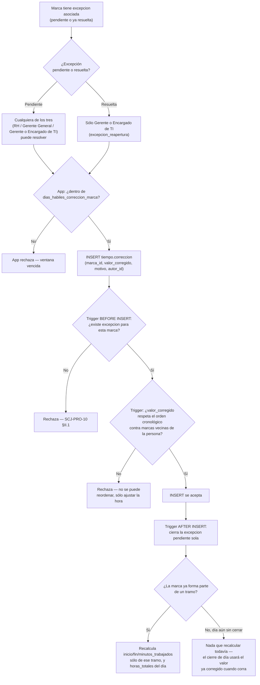

# Proceso — Corrección de marca

**Sistema de Control de Jornada**
Folio SCJ-PRO-10 · Versión 1.0 · 5 de septiembre de 2026

Cuarto `SCJ-PRO` del subsistema de **Tiempo**. Cubre cómo se corrige el valor de una marca
(`tiempo.correccion`) sin modificarla nunca — `SCJ-DEC-03`.

---

## I. Alcance

**Cubre:** desde que una marca tiene una `excepcion` asociada, hasta que la corrección queda
registrada, la excepción pendiente se cierra sola, y el `tramo`/`dia` afectados quedan
recalculados.

**No cubre — son procesos o piezas pendientes en otro lugar:**

- Cómo llega la marca a tener una `excepcion` en primer lugar — eso lo decide el batch de cierre de
  día (pendiente de diseñar aparte) o el registro directo con `requiere_revision=true`.
- Recalcular `clasificacion_de_tiempo.tipo` tras una corrección — depende del disparador de
  clasificación, todavía sin programar.

---

## II. Precondiciones

1. **La marca ya tiene una `excepcion` asociada — sin excepción, no hay corrección posible.** Es la
   única señal que tiene el sistema de que esa marca necesita revisión; no existe corrección libre
   sobre cualquier marca.
2. Quien corrige tiene permiso `correccion_edicion` — hoy `Gerente General`, `Responsable de
   Recursos Humanos`, `Gerente o Encargado de TI` (`db/ddl/35_permiso_correccion_migracion_
   inicial.sql`, `36_puesto_permiso_correccion_mapeo_inicial.sql`), mismos tres del resto del
   módulo. Heredable, igual que `ausencia`/`excepcion`.
3. **Si la `excepcion` ya está `resuelto`** (se quiere editar/reabrir una que ya se cerró), hace
   falta además `excepcion_reapertura` — **no heredable, exclusivo de `Gerente o Encargado de
   TI`**. Ni RH ni Gerente General pueden hacerlo, aunque tengan `correccion_edicion`.
4. La marca a corregir sigue dentro de la ventana de `tiempo.parametro.dias_habiles_correccion_
   marca` (30 días hábiles de ejemplo) contados desde su `momento_dispositivo`.

---

## III. Diagrama de flujo — estado objetivo

---

## IV. Descripción paso a paso

| Paso | Actor | Acción | Toca |
|---|---|---|---|
| A1-B1 | — | La marca tiene una excepción; se revisa si ya estaba resuelta | `tiempo.excepcion` |
| C1/C2 | Usuario | Según el estado de la excepción, resuelve cualquiera de los tres o sólo TI | — |
| D1-D2 | App | Valida la ventana de 30 días hábiles antes de enviar (validación de UX, no de integridad) | `tiempo.parametro` |
| E1 | Usuario | Envía la corrección | `tiempo.correccion` |
| F1-F2 | Sistema (trigger `BEFORE INSERT`) | Exige que exista una excepción para esa marca | `tiempo.excepcion` |
| G1-G2 | Sistema (trigger) | Calcula el momento efectivo de la marca anterior y siguiente de la misma persona (última corrección si existe, si no el original) y bloquea si `valor_corregido` cruza cualquiera de las dos | `tiempo.marca`, `tiempo.correccion` |
| H1 | Sistema | Inserta la corrección | `tiempo.correccion` |
| I1 | Sistema (trigger `AFTER INSERT`) | Cierra sola la excepción si seguía `pendiente` | `tiempo.excepcion` |
| J1-K2 | Sistema (trigger) | Si la marca ya pertenece a un `tramo`, recalcula ese tramo y `dia.horas_totales` — nunca el histórico completo | `tiempo.tramo`, `tiempo.dia` |

---

## V. Reglas de negocio confirmadas

- **Sólo se corrige resolviendo una excepción — nunca libre.** Sin excepción asociada, el sistema
  no tiene forma de saber que esa marca necesitaba revisión (confirmado por el usuario).
- **Editar/reabrir una excepción ya resuelta es exclusivo de TI**, con un permiso propio
  (`excepcion_reapertura`) distinto del `excepcion_edicion` que ya tienen los tres — evita que la
  autorización dependa de comparar el nombre del puesto en el código; es un permiso atómico más,
  mismo patrón que el resto del proyecto.
- **La corrección ajusta la hora, nunca el orden.** Si el nuevo valor haría que esa marca deje de
  estar entre su vecina anterior y siguiente (cruzaría el orden cronológico de la persona), el
  sistema bloquea la corrección — se calcula contra el **momento efectivo** de las marcas vecinas
  (la corrección más reciente si ya tienen una, si no su valor original), no contra el valor
  original si ya fue corregido antes.
- **Esta regla vive en la base (`CONSTRAINT` no aplica, es `BEFORE INSERT` normal porque
  `correccion` se inserta fila por fila, no en lote como `patron_semanal`)** — es la misma
  integridad que sostiene el modelo de paridad/tramo completo, no una regla de negocio cualquiera.
- **La ventana de 30 días hábiles vive sólo en la aplicación**, a diferencia de lo anterior — es
  política de proceso, no una invariante estructural; el costo de que alguien la salte por
  PostgREST directo es bajo, y el valor real (30) es configurable en `tiempo.parametro` para poder
  cambiarlo sin tocar código.
- **El recálculo tras corregir es automático y acotado.** Sólo el `tramo` que usa esa marca como
  apertura o cierre, y el `horas_totales` del `dia` al que pertenece — nunca se recorre el
  histórico completo ni se tocan otros días.
- **Si la marca todavía no forma parte de ningún `tramo`** (el día sigue abierto, el batch de
  cierre no ha corrido), no hay nada que recalcular en el momento — el cierre de día, cuando corra,
  ya va a usar el valor corregido porque lee `momento_dispositivo` desde la marca original más su
  cadena de correcciones, no un valor cacheado.

---

## VI. Estado actual — nada construido todavía

Los dos disparadores (`fn_correccion_valida`, `fn_correccion_recalcula_tramo`) ya están en
`db/ddl/02_tiempo.sql`, junto con los 3 permisos (`db/ddl/35_*.sql`, `36_*.sql`). Falta:

1. Backend: endpoint de corrección, con la validación de la ventana de 30 días hábiles (día hábil =
   ni domingo ni `tiempo.dia_festivo`) antes de enviar, y el gate de `correccion_edicion` /
   `excepcion_reapertura` según el estado de la excepción.
2. RLS de `tiempo.correccion` — no existe todavía.
3. Frontend: formulario de corrección desde la cola de excepciones, con el mensaje claro cuando el
   trigger rechaza por orden cronológico o por ventana vencida.

---

## VII. Siguiente paso

Con `SCJ-PRO-07`, `08`, `09` y este, el subsistema de Tiempo tiene 4 procesos documentados. Sigue:
registro por terminal, y los batches de cierre de día / corte quincenal que varios de estos
documentos ya dan por existentes sin haberlos diseñado todavía.

---

*Proceso · Folio SCJ-PRO-10 · V1.0*
