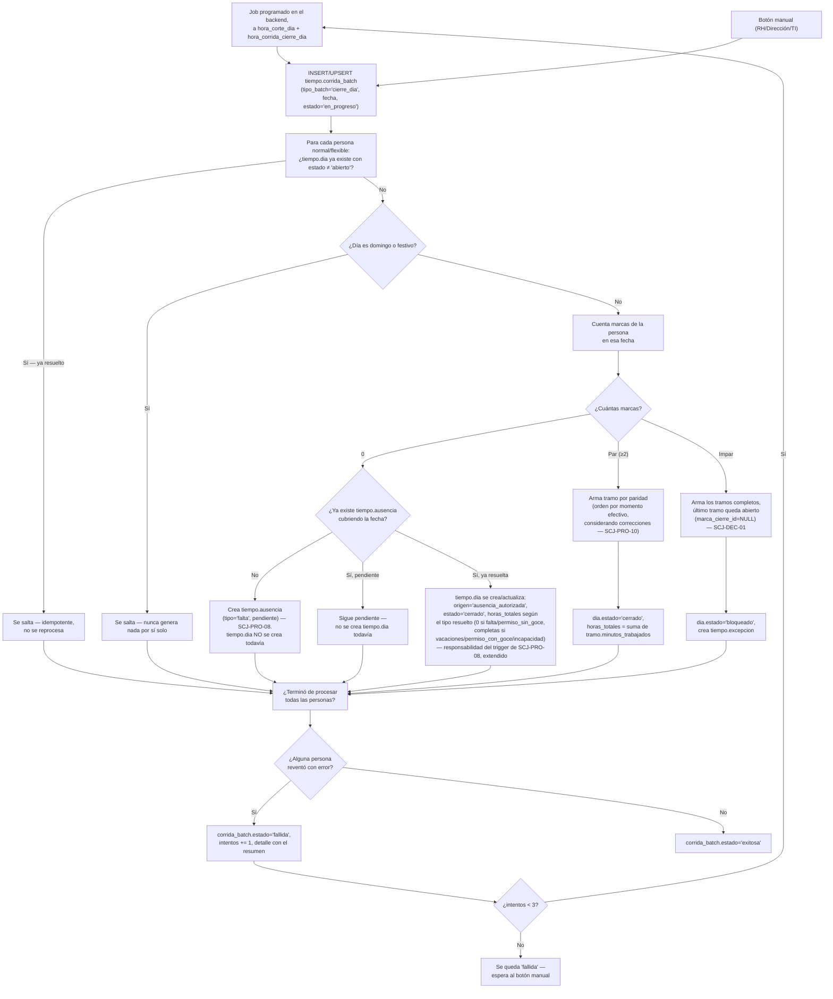

# Proceso — Cierre de día

**Sistema de Control de Jornada**
Folio SCJ-PRO-12 · Versión 1.0 · 5 de septiembre de 2026

Sexto `SCJ-PRO` del subsistema de **Tiempo**, y el primero puramente de sistema — no lo dispara un
usuario resolviendo algo, lo dispara el reloj. Es el batch del que ya dependían `SCJ-PRO-08`
(crea la `ausencia` autodetectada), `SCJ-PRO-10` (recalcula el `tramo` si ya existe) y `SCJ-PRO-11`
(deja la marca lista para que este batch la procese).

---

## I. Alcance

**Cubre:** el cierre de día para jornadas `normal`/`flexible` (basadas en marca) — desde que hay
marcas de un día por procesar, hasta que `tiempo.dia`/`tramo` quedan resueltos (o el día queda
`bloqueado`/con `ausencia` pendiente, con la razón registrada).

**No cubre — son los otros dos batches, documentos aparte:**

- **Corte quincenal** (`generado_quincena`) — depende de que este batch ya haya corrido para todo
  el periodo. Documento siguiente.
- **Batch de jornada `de_confianza`** — no usa `marca`/`tramo` en absoluto, es independiente de
  éste. Documento aparte.
- **Clasificación de `clasificacion_de_tiempo.tipo`** (ordinario/reposición/extra) — sigue sin
  disparador propio; este batch dejaría el `tramo` listo, pero no lo clasifica todavía.
- **Valor exacto de `horas_totales` de un día `bloqueado`, una vez revisado** — resuelto que se
  excluye del corte quincenal mientras siga `bloqueado` (`SCJ-ESP-01 V2.1 §VI.2`); el cálculo
  exacto del relleno queda para cuando se aplique a la empresa real. Ver `SCJ-PRA-01 #14`.

---

## II. Precondiciones

1. Existe `tiempo.parametro.hora_corrida_cierre_dia` (ejemplo `03:00`) — el colchón después de
   `hora_corte_dia` para dar tiempo a que los terminales sincronicen (`SCJ-CDT-01`: las marcas
   pueden llegar horas o días tarde).
2. Sólo aplica a personas con `jornada_asignada.tipo_jornada` en (`normal`, `flexible`) — las
   `de_confianza` las procesa el otro batch.

---

## III. Diagrama de flujo — estado objetivo

---

## IV. Descripción paso a paso

| Paso | Actor | Acción | Toca |
|---|---|---|---|
| A1/Z1 | Sistema / Usuario | El job programado o el botón manual disparan la misma invocación | — |
| B1 | Sistema | `UPSERT` en `tiempo.corrida_batch` por `(tipo_batch, fecha)` — arranca o reintenta la misma corrida | `tiempo.corrida_batch` |
| C1/C2 | Sistema | Por persona: si `tiempo.dia` ya está resuelto, se salta — **es lo que hace idempotente reintentar/reprocesar** | `tiempo.dia` |
| D1/D2 | Sistema | Domingo/festivo nunca genera nada — se deriva de la fecha, no necesita tabla | `tiempo.dia_festivo` |
| E1/F1 | Sistema | Cuenta las marcas de esa persona/fecha | `tiempo.marca` |
| G1-G4 | Sistema | Sin marcas: resuelve contra `ausencia` — crea una nueva si no hay ninguna, espera si está pendiente, o materializa `tiempo.dia` si ya se resolvió | `tiempo.ausencia`, `tiempo.dia` |
| H1/H2 | Sistema | Paridad par: arma `tramo`, cierra el día | `tiempo.tramo`, `tiempo.dia` |
| I1/I2 | Sistema | Paridad impar: arma lo que se pueda, bloquea el día, abre `excepcion` (`SCJ-DEC-01` Opción C) | `tiempo.tramo`, `tiempo.dia`, `tiempo.excepcion` |
| K1-K3 | Sistema | Si alguna persona reventó, la corrida es `fallida`; si no, `exitosa` — una persona que reventó no detiene a las demás | `tiempo.corrida_batch` |
| L1/L2 | Sistema | Reintenta automático hasta 3 veces; después de eso, espera al botón manual (misma invocación) | `tiempo.corrida_batch` |

---

## V. Reglas de negocio confirmadas

- **Disparo combinado: job programado + botón manual, misma invocación.** El botón no es un modo
  aparte — es la misma función que llama el job, invocada a mano.
- **Colchón fijo, configurable:** corre a `hora_corte_dia` + `tiempo.parametro.hora_corrida_
  cierre_dia` (ejemplo `03:00`), no al corte exacto — los terminales pueden tardar en sincronizar.
- **Idempotente por persona, no por corrida completa.** Una persona con `tiempo.dia` ya resuelto se
  salta siempre — esto es lo que permite que "reintentar 3 veces" y "reprocesar con el botón" sean
  la misma operación sin necesitar rastrear qué falló específicamente.
- **Una persona que revienta no detiene a las demás** — cada una se procesa de forma aislada; la
  corrida se marca `fallida` en conjunto, pero el trabajo ya hecho para otras personas no se pierde
  ni se repite.
- **3 reintentos automáticos**, después de eso queda `fallida` esperando el botón manual — mismo
  mecanismo, no hay una ruta de reintento distinta a la manual.
- **`tiempo.corrida_batch` es el estado visible** — de ahí lee la app "última corrida: fecha,
  estado, intentos" sin entrar a Supabase ni a logs.
- **Día sin marca y sin ausencia → se crea la ausencia, no se cierra el día todavía.** Confirmado en
  `SCJ-PRO-08`: el sistema genera la solicitud, alguien la resuelve, y **sólo entonces** el día
  queda materializado (`origen='ausencia_autorizada'`).
- **`dia.origen` corregido de paso:** el `CHECK` traía `'terminal'` por error — nunca se usó (el
  caso de marcas reales siempre fue `NULL`). Ahora son `NULL` (marcas reales), `automatico_
  confianza`, o `ausencia_autorizada` (nuevo, para este batch).
- **Domingo y festivo nunca generan nada por sí solos** — se filtran antes de cualquier otra regla,
  sin importar si hay marca o no ese día.

---

## VI. Estado actual

Lo que ya existe y de lo que este batch depende: `fn_marca_valida_revision`/`trg_marca_valida_
revision` (`SCJ-PRO-11`, deja la marca lista), `fn_correccion_recalcula_tramo` (`SCJ-PRO-10`, ya
sabe recalcular un tramo si se corrige después de que el día cerró), `tiempo.corrida_batch`
(ya en el esquema). **Resuelto el mismo día:** `fn_ausencia_resuelve_excepcion` ya materializa
`tiempo.dia` al resolver una ausencia (`origen='ausencia_autorizada'`, jornada completa si
`vacaciones`/`permiso_con_goce`/`incapacidad`, cero si `permiso_sin_goce`/`falta` rechazada) —
cierra `SCJ-PRA-01 #13`, el paso G4 de §III ya funciona. También se decidió que un día `bloqueado`
se excluye del corte quincenal hasta `revisado` (`SCJ-ESP-01 V2.1`) — cierra la mitad de
`SCJ-PRA-01 #14`, queda abierto sólo el valor exacto de relleno, para cuando se aplique a la
empresa real. Falta:

1. **El batch en sí** — la función que recorre las personas y aplica el algoritmo de §III/§IV. Es
   la pieza más grande y de más riesgo del subsistema (afecta cálculo de horas/nómina) — se
   construye e itera con pruebas reales, no de un solo intento sin verificar.
2. Job programado en el backend (APScheduler o similar) + endpoint del botón manual.
3. RLS de `tiempo.corrida_batch`/`tiempo.tramo`/`tiempo.dia` — no existen todavía.

---

## VII. Siguiente paso

Con este documento, el batch de cierre de día queda diseñado (aunque no programado). Siguen, en
este orden porque dependen de que éste exista: **corte quincenal**, luego **batch `de_confianza`**
(el más simple, puede adelantarse si conviene), y la **clasificación de tiempo**
(`clasificacion_de_tiempo.tipo`), que depende de que `tramo` ya esté armado por este batch.

---

*Proceso · Folio SCJ-PRO-12 · V1.0*
