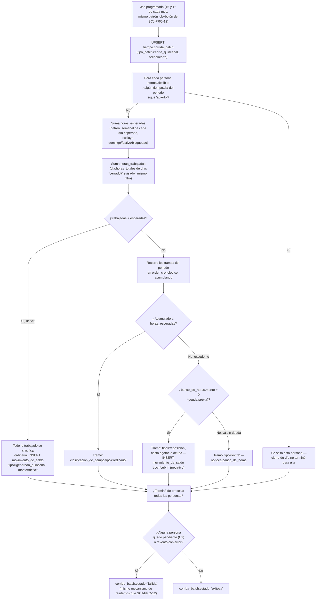

# Proceso — Corte quincenal

**Sistema de Control de Jornada**
Folio SCJ-PRO-13 · Versión 1.0 · 5 de septiembre de 2026

Séptimo `SCJ-PRO` del subsistema de **Tiempo**. Cubre, en un solo documento, el corte de banco de
horas (`generado_quincena`, `SCJ-DEC-02`) **y** la clasificación de tiempo por tramo
(`clasificacion_de_tiempo.tipo`) — combinados a propósito: reposición sólo se puede determinar
sabiendo si la persona tenía deuda, y eso sólo se sabe al momento del corte.

---

## I. Alcance

**Cubre:** desde que un periodo quincenal termina, hasta que cada persona `normal`/`flexible`
queda con su `clasificacion_de_tiempo` completa por tramo del periodo, y su `banco_de_horas`
actualizado si hubo déficit.

**No cubre:**

- Jornada `de_confianza` — por diseño no maneja horas extra ni banco de horas (`SCJ-ESP-01 §VI.3`),
  queda fuera de este corte por completo.
- Resolución manual del saldo (`cubrir`/`arrastrar`/`descontar`/`condonar` que decide RH) — es un
  proceso de aplicación aparte, no un batch.
- Qué pasa si se corrige una marca **después** de que su periodo ya cerró — `SCJ-PRO-10` recalcula
  el tramo, pero no reabre un corte quincenal ya hecho. Pendiente de decidir aparte.

---

## II. Precondiciones

1. **Cierre de día ya corrió para todo el periodo** (`SCJ-PRO-12`). Si alguna persona tiene un
   `tiempo.dia` todavía `abierto` dentro del rango, esa persona se salta este corte — no se puede
   calcular sin saber el estado real de todos sus días. Un día `bloqueado` **no** cuenta como
   pendiente: se excluye del cálculo (§V), no bloquea a la persona.
2. Existe `tope_legal` y `patron_semanal` vigentes para calcular horas esperadas.

---

## III. Diagrama de flujo — estado objetivo

---

## IV. Descripción paso a paso

| Paso | Actor | Acción | Toca |
|---|---|---|---|
| A1/B1 | Sistema | Job programado + botón manual, misma invocación (mismo mecanismo de `SCJ-PRO-12`) | `tiempo.corrida_batch` |
| C1/C2 | Sistema | Salta a cualquier persona con un día todavía `abierto` en el periodo — no se puede calcular sin cierre de día completo | `tiempo.dia` |
| D1/D2 | Sistema | Suma horas esperadas y trabajadas del periodo, excluyendo domingo/festivo/`bloqueado` de ambos lados | `tiempo.dia`, `tiempo.patron_semanal` |
| E1/F1 | Sistema | Déficit: todo lo trabajado es `ordinario`, el faltante genera deuda | `tiempo.clasificacion_de_tiempo`, `tiempo.movimiento_de_saldo` |
| G1/H1/H2 | Sistema | Sin déficit: recorre tramos en orden, cada uno `ordinario` mientras el acumulado no rebase lo esperado | `tiempo.clasificacion_de_tiempo` |
| I1/I2 | Sistema | Excedente con deuda previa: `reposicion`, reduce `banco_de_horas` vía `movimiento_de_saldo` tipo `cubrir` | `tiempo.clasificacion_de_tiempo`, `tiempo.movimiento_de_saldo` |
| I3 | Sistema | Excedente sin deuda: `extra`, sin tocar el banco de horas — es obligación de pago aparte | `tiempo.clasificacion_de_tiempo` |
| K1-K3 | Sistema | Mismo criterio de éxito/falla que `SCJ-PRO-12`: una persona pendiente o un error no detiene a las demás | `tiempo.corrida_batch` |

---

## V. Reglas de negocio confirmadas

- **Periodos fijos: días 1-15 y 16-30 de cada mes.** Si el mes tiene menos de 30 días (febrero), el
  segundo periodo cierra en el último día real (28 o 29). **Si el mes tiene 31 días, el día 31 no
  cierra su propio periodo — se cuenta en el periodo siguiente** (el `[1,15]` del mes que entra,
  que en la práctica arranca desde ese día 31).
- **Un día `bloqueado` no bloquea a la persona, se excluye del cálculo** — ni cuenta como esperado
  ni como trabajado, en ninguno de los dos lados de la resta. Consistente con `SCJ-ESP-01 V2.1
  §VI.2`: no se sabe su valor real hasta `revisado`, así que no se usa ninguno todavía.
- **Un día `abierto` sí bloquea — a la persona, no al corte completo.** Significa que el cierre de
  día no terminó para ella; se salta esta corrida y se reintenta con el mismo mecanismo de
  `SCJ-PRO-12`.
- **Clasificación por tramo, cronológica, acumulada dentro del periodo** — no por día ni por
  proporción. El mismo tramo nunca se parte entre dos clasificaciones.
- **Orden de clasificación: ordinario → reposición (si hay deuda) → extra (si no hay o ya se
  agotó).** Reposición nunca rebasa la deuda existente — el resto, si sobra, es extra.
- **Déficit de periodo: todo lo trabajado es ordinario**, sin excepción — el faltante es lo único
  que genera `movimiento_de_saldo`, nunca al revés (no hay clasificación negativa por tramo).
- **`extra` nunca toca `banco_de_horas`** — es la regla ya cerrada de "no hay saldo a favor"
  (`SCJ-ESP-01 §VI.6`): el excedente sin deuda se resuelve como pago en el momento, no se acumula.
- **`reposicion` se registra como `movimiento_de_saldo` tipo `cubrir`, con `monto` negativo** —
  mismo disparador ya existente (`fn_movimiento_de_saldo_actualiza_banco`) resta el monto del
  saldo, sin lógica nueva de banco de horas.
- **Misma orquestación que `SCJ-PRO-12`**: job programado + botón manual, misma invocación,
  `tiempo.corrida_batch` (`tipo_batch='corte_quincenal'`, ya contemplado en el `CHECK`), idempotente
  por persona.

---

## VI. Estado actual — nada construido todavía

**Sin cambios de esquema** — `clasificacion_de_tiempo.tipo` (`ordinario`/`reposicion`/`extra`) y
`movimiento_de_saldo.tipo` (`generado_quincena`/`cubrir`) ya existían con los valores correctos;
`corrida_batch.tipo_batch` ya incluía `corte_quincenal`. Este documento sólo diseña el algoritmo
que los usa. Falta:

1. **El batch en sí** — mismo criterio que `SCJ-PRO-12`: es la otra pieza de más riesgo del
   subsistema (afecta directamente banco de horas y clasificación de pago), se construye con
   pruebas reales.
2. Job programado (mismo mecanismo de `SCJ-PRO-12`, corre el 1° y el 16°) + botón manual.
3. RLS de `tiempo.clasificacion_de_tiempo`/`movimiento_de_saldo`/`banco_de_horas` — no existen.

---

## VII. Siguiente paso

Con `SCJ-PRO-07` a `13`, el subsistema de Tiempo tiene 7 procesos documentados — cierre de día y
corte quincenal, los dos batches de mayor riesgo, comparten la misma orquestación y probablemente
conviene implementarlos juntos. Queda: el batch de jornada `de_confianza` (el más simple e
independiente de los dos anteriores).

---

*Proceso · Folio SCJ-PRO-13 · V1.0*
