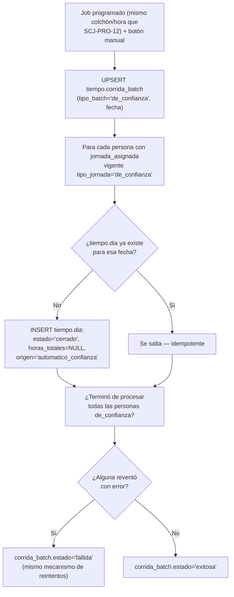

# Proceso — Batch de jornada de_confianza

**Sistema de Control de Jornada**
Folio SCJ-PRO-14 · Versión 1.0 · 5 de septiembre de 2026

Octavo y último `SCJ-PRO` de batches del subsistema de **Tiempo**. Cubre cómo se materializa
`tiempo.dia` para personas con `jornada_asignada.tipo_jornada = 'de_confianza'` — sin marca, sin
tramo, sin terminal.

---

## I. Alcance

**Cubre:** desde que existe una `jornada_asignada` vigente de tipo `de_confianza`, hasta que
`tiempo.dia` queda materializado para cada fecha, sin excepción.

**No cubre:**

- Cálculo de primas dominical/festivo — se deriva de la fecha (domingo por día de la semana,
  festivo contra `tiempo.dia_festivo`) en el reporte de nómina, fuera de este repositorio. Este
  batch sólo dEja el día creado; no decide ni marca la prima.
- Corte quincenal/banco de horas — `de_confianza` está excluido por completo (`SCJ-PRO-13 §I`).

---

## II. Precondiciones

1. Existe `jornada_asignada` vigente con `tipo_jornada = 'de_confianza'` para la persona.
2. No hace falta `patron_semanal` real — es un formalismo de la tabla (ejemplo típico: lunes a
   sábado), el batch no lo consulta para decidir qué días crear.

---

## III. Diagrama de flujo — estado objetivo

---

## IV. Descripción paso a paso

| Paso | Actor | Acción | Toca |
|---|---|---|---|
| A1/B1 | Sistema | Job programado + botón manual, misma invocación y mecanismo de `SCJ-PRO-12` | `tiempo.corrida_batch` |
| C1 | Sistema | Recorre sólo personas con `jornada_asignada` vigente `de_confianza` | `tiempo.jornada_asignada` |
| D1/D2 | Sistema | Si `tiempo.dia` ya existe para esa fecha, se salta — idempotente | `tiempo.dia` |
| E1 | Sistema | Crea el día directo: `estado='cerrado'`, `horas_totales=NULL`, `origen='automatico_confianza'` | `tiempo.dia` |
| F1/G1-G3 | Sistema | Mismo criterio de éxito/falla y reintentos que `SCJ-PRO-12`/`13` | `tiempo.corrida_batch` |

---

## V. Reglas de negocio confirmadas

- **Todos los días son trabajados, sin excepción — el patrón semanal es un formalismo, no se
  consulta.** No hay distinción de días esperados/no esperados para `de_confianza`.
- **Domingo y festivo tampoco se filtran aquí** — se crean igual que cualquier otro día. La
  distinción sólo importa para nómina, que la deriva de la fecha después; Tiempo no necesita
  tratarlos distinto al crear el día.
- **`horas_totales = NULL`, nunca `0`.** No hay marca ni patrón real que contar — `NULL` significa
  "sin dato que registrar", no "trabajó cero horas". Evita que un reporte futuro confunda "de
  confianza" con "faltó".
  **Excepción deliberada (8 sep 2026, `db/ddl/66_tiempo_ausencia_descuento_pausa_y_confianza.sql`):**
  cuando una ausencia se resuelve para una persona `de_confianza` (cualquier tipo, incluso
  rechazada — "su horario no marca faltas"), `fn_ausencia_resuelve_excepcion` SÍ le pone la
  jornada completa pactada (menos el descuento de pausa no registrada), nunca `0`. Sólo cae a
  `NULL` si no hay patrón cargado ese día de semana — ahí sí sigue vigente esta regla, como
  último recurso, no como caso general. Esta es la única vía que le pone un número a un día
  `de_confianza`; el batch rutinario de este documento sigue poniendo siempre `NULL`.
- **Nunca se genera `marca` ni `tramo` sintéticos** — decisión ya tomada, contaminarían `marca`
  como evidencia legal de jornada (`SCJ-ESP-01 §VI.3`).
- **Sin cambios de esquema** — `tiempo.dia.origen` ya incluía `'automatico_confianza'`,
  `horas_totales` ya era nullable, `corrida_batch.tipo_batch` ya incluía `'de_confianza'`. Este
  documento sólo diseña el algoritmo, el más simple de los tres batches.
- **Misma orquestación que `SCJ-PRO-12`/`13`** — job + botón manual, misma invocación,
  `tiempo.corrida_batch`, idempotente por persona.

---

## VI. Estado actual — nada construido todavía

Sin cambios de esquema pendientes. Falta:

1. El batch en sí — el más simple de los tres, bajo riesgo (no calcula horas ni dinero, sólo marca
   presencia). Puede construirse antes que cierre de día/corte quincenal si conviene por orden de
   implementación.
2. Job programado (mismo mecanismo que `SCJ-PRO-12`/`13`) + botón manual.
3. RLS de `tiempo.dia` para este flujo — comparte la misma RLS pendiente de los otros dos batches.

---

## VII. Siguiente paso

Con `SCJ-PRO-07` a `14`, el subsistema de Tiempo tiene **8 procesos documentados** — el conjunto
completo de lo identificado hasta hoy. Queda compilarlos junto con `SCJ-MOD`/`SCJ-DEC` en el plan
de implementación (mismo patrón que se siguió para Personas y Estructura Organizacional), y
construir los tres batches (los dos de riesgo — cierre de día, corte quincenal — con pruebas
reales; éste puede ir primero).

---

*Proceso · Folio SCJ-PRO-14 · V1.0*
