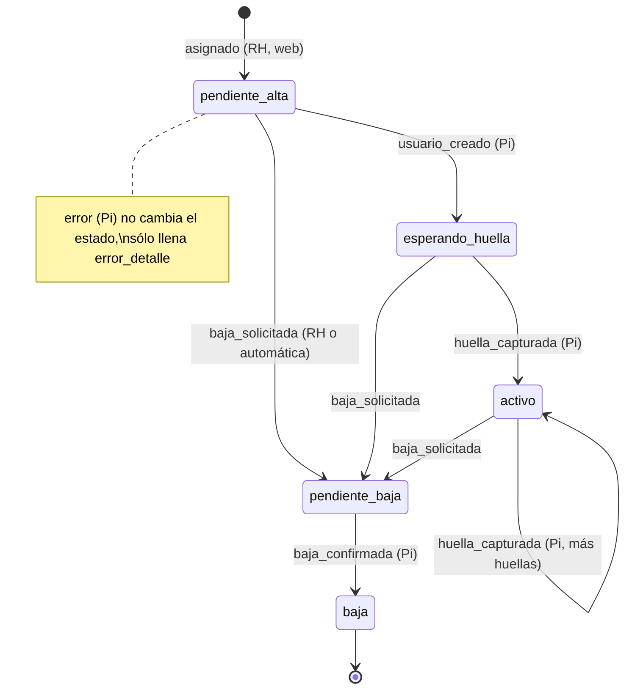
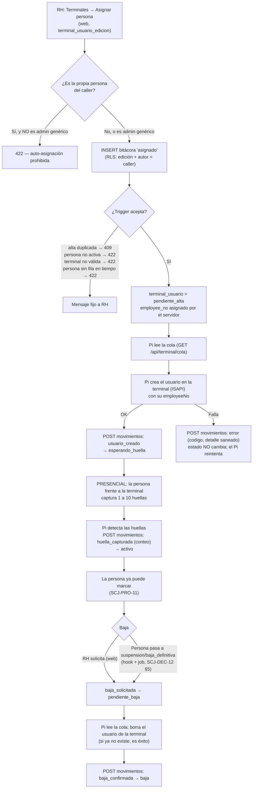

# Proceso — Enrolamiento de terminal

**Sistema de Control de Jornada**
Folio SCJ-PRO-15 · Versión 1.0 · 6 de octubre de 2026

> **Estado: Propuesta (borrador).** Redactado a partir de decisiones ya aceptadas (`SCJ-DEC-11`,
> `SCJ-DEC-12`, `SCJ-PRO-11 V3.0`, `SCJ-CDT-01 V3.0`); lo que **no** está decidido por ellas se lista
> como pregunta abierta en §IX. Nada de este proceso está construido todavía salvo el DDL de
> `80_*.sql`/`81_*.sql` (§VII).

Proceso del subsistema de **Tiempo** sobre el **aparato de registro** que describe el ciclo de vida
completo de un **usuario de la terminal**: desde que Recursos Humanos asigna a una persona hasta que
su huella está capturada y, más tarde, hasta que se da de baja. Es el
complemento humano de `SCJ-PRO-11` (que cubre cómo llega la marca al servidor): aquí se cubre cómo
llega la **persona** a poder marcar.

---

## I. Alcance

**Cubre:** (a) la asignación de una persona a la terminal desde la aplicación web; (b) la cola de
trabajo que lee el puente (Raspberry Pi); (c) la creación del usuario en la terminal; (d) la captura
presencial de la huella; (e) las huellas adicionales; (f) la baja, manual y automática; (g) los
errores y cómo se recuperan; (h) las reglas de quién puede hacer qué (`terminal_usuario_lectura`,
`terminal_usuario_edicion`, auto-asignación); (i) las pantallas que implica, para `frontend`.

**No cubre — son otras piezas, ya resueltas o en otro documento:**

- **La captura de la huella en sí.** Ocurre **siempre de forma presencial, frente a la terminal**, y
  la huella **nunca sale del aparato** ni se guarda en este repositorio ni en la base: sólo se guarda
  el **conteo** de huellas (`SCJ-DEC-11`).
- **El código del puente** y su base local: es un subproyecto aparte (`SCJ-PRO-11 §I`).
- **Cómo llega y se valida una marca** y el cálculo de `requiere_revision`: `SCJ-PRO-11`.
- **La credencial del Pi, el RPC de ingreso de marcas y los endpoints** (diseño): `SCJ-DEC-12`.
- **Alta de la persona y su estado** (`activo`, `suspension`, `baja_definitiva`): `SCJ-PRO-01` y
  `SCJ-PRO-02`. **Otorgar permisos a un puesto:** `SCJ-PRO-05`.
- **Desactivación de la terminal completa:** procedimiento en `SCJ-DEC-12 §6`; aquí sólo se
  referencia.

---

## II. Precondiciones

1. La persona existe y está `activo` en `personas.persona`, y tiene fila en `tiempo.persona` (la
   frontera `SCJ-FRO-01` sincronizada). Sin esa fila la asignación se rechaza (`23503`).
2. La terminal está dada de alta en `tiempo.terminal` y `activa`. El alta es un `INSERT` puntual
   con la serie del aparato, no un seed del DDL (`SCJ-PRO-11 §VI`).
3. El Pi tiene su llave de terminal vigente y está en contacto (latido reciente, `SCJ-DEC-12 §1`,
   `§6`). Si no lo está, la asignación se **registra** igual y espera en `pendiente_alta`.
4. Quien asigna tiene `terminal_usuario_edicion` (§V.2). Quien sólo consulta, `terminal_usuario_lectura`.
5. *(Precondición operativa, no validada por el sistema.)* La persona otorgó su **consentimiento
   biométrico**. Quien no lo otorga, o no logra enrolar, marca por **captura manual**
   (`SCJ-PRO-07`, `SCJ-CDT-01 §XIII`) y **no** se asigna a la terminal.

---

## III. Diagramas

### III.1 Estados del alta (`tiempo.terminal_usuario.estado`)

Los transiciona **sólo** el trigger de la bitácora (`SCJ-DEC-11`); nadie escribe la tabla viva.

### III.2 Flujo de punta a punta

---

## IV. Descripción paso a paso

### IV.1 Alta

1. **Asignar (web).** RH elige una persona `activo` y una terminal y pulsa "Asignar". El backend
   inserta un movimiento `asignado` en `tiempo.bitacora_movimiento_terminal_usuario` con el cliente
   **del propio usuario** (la RLS es la autorización real: exige `terminal_usuario_edicion`,
   `origen='web'` y `registrado_por = auth.uid()`; `SCJ-DEC-12 §4`). Antes, el backend aplica la regla
   de **auto-asignación** (§V.3).
2. **El servidor valida y registra.** El trigger de la bitácora verifica terminal activa, persona
   `activo` y que no exista otra alta no-`baja` de esa persona en esa terminal; asigna el
   `employee_no` desde `tiempo.seq_terminal_employee_no` (global, sin ciclo, **nunca reutilizado**) y
   deja el alta en `pendiente_alta`.
3. **El Pi lee la cola.** Periódicamente consulta `GET /api/terminal/cola`: altas de **su** terminal en
   `pendiente_alta`, `esperando_huella` o `pendiente_baja`, con `employee_no`, estado y conteo de
   huellas. **Sin `persona_id`, sin nombre**: el aparato rotula al usuario con su `employee_no`
   (Q6 de `SCJ-DEC-12`).
4. **Crear el usuario en la terminal.** Para cada `pendiente_alta` el Pi crea el usuario por ISAPI
   con ese `employeeNo` y reporta `usuario_creado` → `esperando_huella`. Si el reporte se repite
   (reintento tras perder la respuesta), el servidor responde `ya_aplicado` sin insertar.
5. **Captura presencial de la huella.** La persona se presenta **físicamente** frente a la
   terminal y se le captura de 1 a 10 huellas. Ningún paso de este proceso captura huellas de forma
   remota.
6. **Confirmación.** El Pi detecta las huellas registradas y reporta `huella_capturada` con el
   conteo (1–10) → `activo`. Desde ese momento la persona puede marcar.
7. **Huellas adicionales.** Si alguien registra otra huella después, el Pi reporta de nuevo
   `huella_capturada` con el conteo actualizado: se permite desde `esperando_huella` **o** `activo`.

### IV.2 Baja

1. **Origen.** Sólo dos caminos, ambos del servidor: **(a)** RH solicita la baja desde la web
   (`baja_solicitada`, con motivo opcional, requiere `terminal_usuario_edicion`); **(b)** la persona
   deja de estar `activo` (`suspension` o `baja_definitiva`) y el servidor emite `baja_solicitada` de
   sus altas vigentes por su cuenta (hook sincrónico más job idempotente, atribuido a quien dejó
   inactiva a la persona; `SCJ-DEC-12 §5`). El Pi **no puede** pedir bajas.
2. **Se acepta desde cualquier estado salvo `pendiente_baja` o `baja`**, incluido `pendiente_alta`
   (alguien se asignó por error y nunca llegó a crearse en el aparato).
3. **El Pi borra el usuario** de la terminal y reporta `baja_confirmada` → `baja`. **Si el usuario ya
   no existe en el aparato (caso de `pendiente_alta`), se trata como éxito** y se confirma la baja.
4. **Consecuencias.** El `employee_no` no se reutiliza. **Reactivar a la persona no la reenrola:** su
   alta ya está en `pendiente_baja` o `baja`; RH debe asignarla de nuevo (otro `employee_no`, huella
   nueva presencial).
5. Mientras la baja no se confirme en el aparato, la persona **todavía puede marcar**; esas marcas
   entran señaladas con `persona_inactiva` (`SCJ-PRO-11 §IV`), no se rechazan.

### IV.3 Errores

| Dónde | Qué pasa | Qué hace el sistema |
|---|---|---|
| Web: alta duplicada | La persona ya tiene alta vigente en esa terminal | `409` mensaje fijo |
| Web: persona no activa / terminal no válida | No existe, no está `activo`, o la terminal está inactiva | `422` mensaje fijo |
| Web: persona sin fila en `tiempo.persona` | La frontera no se sincronizó | `422` "avisa a Sistemas" |
| Web: carrera entre dos asignaciones | Dos altas simultáneas de la misma persona | `409` "recarga" |
| Web: movimiento inválido para el estado | Ej. pedir baja de una alta ya en `pendiente_baja` | `409` mensaje fijo |
| Web: sin permiso o cuenta suspendida | La RLS lo rechaza | `403` (y `ERROR` en el log del servidor) |
| Pi: no puede crear/borrar el usuario | Falla ISAPI | Reporta `error` con `codigo` corto y `detalle` **sin cuerpos ISAPI ni cabeceras**; **el estado no cambia**, el Pi reintenta; el error se muestra a RH hasta que un movimiento válido lo limpia |
| Pi: `409` al reportar | La alta cambió de estado en el servidor | El Pi **relee la cola**, no reintenta a ciegas |
| Pi: usuario en el aparato que el servidor no conoce | Creado a mano o residuo de una baja | El Pi lo **borra** y reporta `error` con `codigo=usuario_no_mapeado` (reconciliación periódica contra `GET /api/terminal/mapa`) |
| Pi sin contacto | Latido vencido | La pantalla de terminales lo muestra (`sin_contacto`); las altas siguen esperando |

Los mensajes que ve RH son **fijos**; el texto de las excepciones de la base **nunca** se
retransmite (`SCJ-DEC-11` riesgo 3, `SCJ-DEC-12 §4`). La bitácora es **inmutable**: un movimiento
equivocado no se borra, se compensa con movimientos posteriores.

### IV.4 Desactivar una terminal (referencia)

No es un interruptor: baja de **todas** las altas, esperar `baja_confirmada` y `marcas_pendientes=0`,
recién entonces `activa=false`, y **reset físico** del equipo. La base lo impone con el trigger
`SCJ13` (`SCJ-DEC-12 §6`).

---

## V. Reglas de negocio confirmadas

1. **El mapeo `employeeNo` ↔ persona vive en el servidor; el Pi sólo lo cachea** y no conoce a las
   personas (`SCJ-DEC-11`, `SCJ-DEC-12`). Una persona tiene **a lo más un alta vigente por terminal**.
2. **Permisos** (`SCJ-DEC-11`; otorgados a "Responsable de Recursos Humanos", "Gerente General" y
   "Gerente o Encargado de TI"):

   | Permiso | Heredable | Permite |
   |---|---|---|
   | `terminal_usuario_lectura` | **Sí** (el jefe hereda lo del subordinado) | Ver terminales, altas, su estado y la bitácora |
   | `terminal_usuario_edicion` | **No** | Asignar una persona a una terminal y solicitar su baja |

   La edición **no es heredable** porque es un permiso biométrico: que un jefe herede lo del
   subordinado tiene sentido para ver, no para enrolar. **Sin doble autorización:** quien tiene
   `terminal_usuario_edicion` enrola a cualquier persona activa; se acepta porque se limita a tres
   puestos y la bitácora deja constancia de quién (`SCJ-DEC-11` riesgo 2).
3. **Auto-asignación prohibida, salvo el administrador genérico** (decisión del usuario, 2026-10-06):
   el backend responde `422` si la persona asignada es la persona del propio caller, **excepto** si el
   caller ocupa el puesto administrador genérico (`personas.puesto.es_administrador_generico`, hoy
   "Gerente o Encargado de TI"). El backend lo resuelve con `permisos.resolver_persona_id` y
   `resolver_puestos_vigentes` más la columna `es_administrador_generico` (`SCJ-DEC-12 §4`).
4. **La captura de huella es siempre presencial** y las huellas nunca salen del aparato.
5. **Alta y baja las inicia el servidor/RH**; el Pi sólo ejecuta lo pendiente y reporta
   (`usuario_creado`, `huella_capturada`, `baja_confirmada`, `error`). Ni `asignado` ni
   `baja_solicitada` pueden venir del Pi.
6. **La baja nace en el expediente de la persona**, no en la terminal: cuando una persona deja de
   estar `activo` el servidor emite la baja; el aparato la ejecuta como consecuencia.
7. **Un `employee_no` nunca se reutiliza**, y resuelve incluso altas ya en `baja` (una marca
   legítima encolada antes de la baja se atribuye a la persona correcta).
8. **La terminal es sólo de asistencia** (sin puerta ni relé): el peor caso de un compromiso es
   falsear asistencia, no abrir un acceso físico.
9. **Sin nombres en el aparato en esta versión** (`SCJ-DEC-12`, Q6).
10. **Una alta que sigue en `pendiente_alta` no puede generar marcas**: una marca con ese
    `employee_no` se rechaza como `no_enrolado` (el aparato aún no creó ese usuario).

---

## VI. Pantallas que implica (para `frontend`)

Las pantallas siguen el diseño "Kairos" y su mismo patrón de componentes (`Button` con `cargando`,
`Badge`, `Card`, `Input`, tabla con filtros). **Se necesita un mockup previo de cada una** en
`diseno_paginas/` antes de implementarlas, como en los módulos anteriores. Sus datos salen de los
endpoints de `SCJ-DEC-12 §4`.

| # | Pantalla | Quién la ve | Contenido y acciones |
|---|---|---|---|
| 1 | **Terminales** (lista) | `lectura` o `edicion` | Una fila por terminal: nombre, serie, **estado de contacto** (`en_linea`, `sin_contacto`, `nunca`, `inactiva`), última comunicación, `terminal_alcanzable`, desfase del reloj, versión del Pi, marcas pendientes. Sólo lectura |
| 2 | **Usuarios de la terminal** (detalle) | `lectura` o `edicion` | Tabla de altas: persona (nombre), `employee_no`, **estado** (badge de los 5 estados), huellas, fecha, último `error_detalle`. Filtros por estado, persona y fecha; orden por más recientes. Acciones (sólo con `edicion`): **Asignar persona** (selector de personas `activo`; aviso si es auto-asignación) y **Solicitar baja** (confirmación con motivo opcional) |
| 3 | **Historial de un alta** (panel lateral) | `lectura` o `edicion` | Movimientos en orden: tipo, cuándo, **quién** (nombre del usuario, o "Terminal" si `origen=terminal`), detalle |
| 4 | **Tablero de anomalías** | `lectura` o `edicion` | Las 9 categorías de `SCJ-DEC-12 §6` (marcas posteriores a la baja, picos, reloj degradado, huecos, rechazos, credenciales, bajas inconsistentes, altas atascadas, altas recientes) |
| 5 | **Ficha de persona** (sección "Terminal") | quien ya ve la ficha | Estado del alta de esa persona y, con `edicion`, botón "Asignar a la terminal" (mismo patrón que "Crear acceso a Kairos") |
| 6 | **Cambio de estado de persona** (aviso) | quien suspende/da de baja | Si la respuesta trae `advertencias: ["baja_terminal_pendiente"]`, banner: la baja en la terminal quedó pendiente y se reintentará sola |
| 7 | **Navegación** | — | Entrada en el sidebar del módulo Tiempo (grupo propio o dentro de "Parámetros"; a decidir en el mockup) |

Estados de interfaz a diseñar en todas: cargando (botón con `cargando`/`textoCargando`, sin doble
envío), vacío, error con el mensaje fijo del backend, y sin permiso (acciones ocultas o deshabilitadas).
La **herencia** de `terminal_usuario_lectura` y la **no herencia** de `edicion` se resuelven en el
backend; el frontend sólo muestra lo que `GET /api/sesion` o la propia respuesta permitan (ver §IX, P4).

---

## VII. Estado actual — casi nada construido

Ya aplicado en `db/ddl/`: `80_tiempo_terminal_usuario.sql` (`tiempo.terminal`,
`tiempo.terminal_usuario`, `tiempo.seq_terminal_employee_no`, permisos `terminal_usuario_lectura` y
`terminal_usuario_edicion` y su otorgamiento) y `81_tiempo_bitacora_movimiento_terminal_usuario.sql`
(bitácora inmutable y el trigger de transiciones), verificados en la base real.

**Falta** (todo diseñado y aceptado en `SCJ-DEC-12`): `82_*.sql`, `83_*.sql`, `84_*.sql`; los
endpoints de terminal y web; el hook y el job de bajas; las pantallas de §VI; el alta puntual de la
terminal y de su primera llave; el código del puente en su repositorio.

---

## VIII. Siguiente paso

Revisar este borrador con el usuario (sobre todo §IX), pasarlo de "Propuesta" a versión vigente y
encargar los mockups de §VI. El orden de construcción es el de `SCJ-DEC-12 §8.3`: primero el
servidor (DDL, autenticación de terminal, marcas, cola y movimientos), después el router web y las
pantallas, y al final el puente.

---

## IX. Preguntas abiertas (no están decididas por `SCJ-DEC-11` ni `SCJ-DEC-12`)

| # | Pregunta | Recomendación |
|---|---|---|
| P1 | **¿Quién opera el aparato durante la captura de huella** (RH, TI, la propia persona con un menú del aparato) y **¿puede el Pi poner la terminal en modo de captura** por ISAPI mientras la persona está presente? `SCJ-DEC-11` sólo fija que es presencial y que ningún flujo la captura de forma remota | Presencial con una persona de RH/TI junto al aparato. El Pi no dispara la captura; sólo detecta que ya hay huellas. Se confirma al probar el aparato real |
| P2 | **¿Cuánto tiempo puede estar un alta en `pendiente_alta` o `esperando_huella`** antes de aparecer como "atascada" en el tablero (`SCJ-DEC-12 §6` dice "N horas")? | 24 horas, como valor inicial ajustable |
| P3 | **¿El sistema debe validar el consentimiento biométrico** (§II.5) o es sólo un requisito operativo? No existe hoy campo de consentimiento en `personas` | Sólo operativo en esta versión; si se quiere validar, es un cambio de `personas`, fuera de este proceso |
| P4 | **¿Cómo sabe el frontend si el caller tiene `terminal_usuario_edicion`?** Hoy `GET /api/sesion` sólo expone `puede_ver_modulo_1/2/3` | Agregar a `GET /api/sesion` dos banderas (`puede_ver_terminales`, `puede_editar_terminales`) calculadas con `permisos.py`, como las del sidebar; es un cambio de `backend` |
| P5 | **Número de huellas mínimo para pasar a `activo`**: el trigger acepta 1–10, pero ¿se exige un mínimo de 2 por redundancia (dedo dañado)? | 1 en el sistema (lo que ya valida el trigger); si RH quiere 2, es una política de procedimiento, no del DDL |

---

*Proceso · Folio SCJ-PRO-15 · V1.0*
