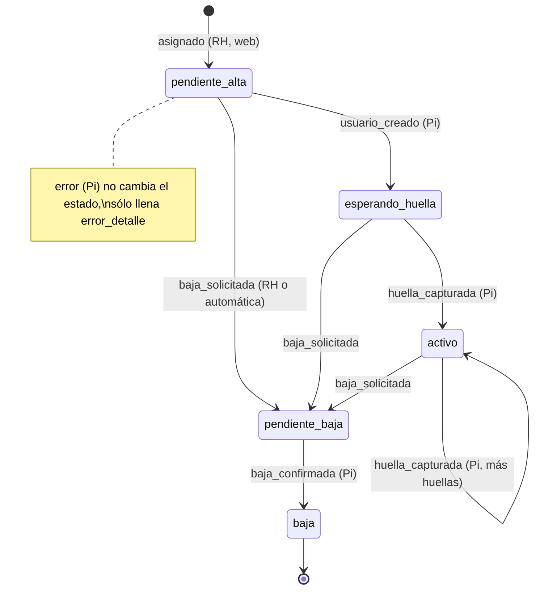
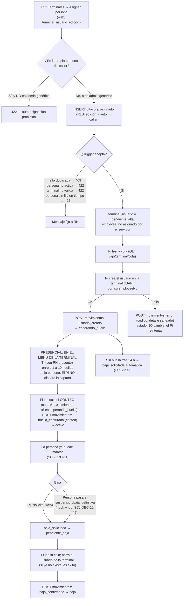

# Proceso — Enrolamiento de terminal

**Sistema de Control de Jornada**
Folio SCJ-PRO-15 · Versión 1.2 · 8 de octubre de 2026

> **Cambio de versión (V1.0 → V1.1, menor):** se incorporan, **sin contradecir lo escrito**, las
> decisiones del usuario del 6 de octubre de 2026 sobre la biometría (`SCJ-DEC-11 V1.1`,
> `SCJ-DEC-12 V2.0 §12`): **(1)** el enrolamiento de huella es **presencial en el menú de la propia
> terminal**, hecho por TI con RH presente, y el Pi no lo dispara; **(2)** procedimiento de custodia de
> la contraseña de administrador del aparato; **(3)** aviso de privacidad y consentimiento expreso por
> escrito antes de enrolar; **(4)** retención y borrado (baja de la persona y decomisión del aparato);
> **(5)** red de la terminal punto a punto como control de compensación; **(6)** caducidad de altas en
> `esperando_huella` (24 h). Se **cierra P1** y se **ajusta P2**. Las pantallas de §VI no tienen botón
> "capturar".

> **Cambio de versión (V1.1 → V1.2, menor):** se incorporan las decisiones del usuario del 8 de octubre de
> 2026 sobre el consentimiento biométrico y la configuración de terminales, **sin contradecir el flujo ya
> escrito** y **cerrando P6 con DDL** (`88_*.sql`): **(1)** el texto de consentimiento deja de ser fijo: es
> una tabla de **versiones** inmutables que editan sólo TI y Gerente General con el permiso nuevo
> `terminal_config_edicion` (RH no); **(2)** cada `asignado` queda ligado a la versión aceptada
> (`consentimiento_id`) y una versión desactualizada se rechaza siempre (`SCJ16`); **(3)** la versión 1 es un
> texto **provisional** sembrado por la migración; **(4)** un **cambio material** de texto obliga a
> **reconsentir** a los ya enrolados (movimiento nuevo `reconsentido`, también en lote), y ese pendiente
> **no bloquea marcas**, sólo se muestra (ficha, lista y tarjeta del tablero); **(5)** la caducidad de altas
> en `esperando_huella` y otras variables del módulo son **editables** con rangos (`89_*.sql`), también para
> las altas ya en curso. El detalle técnico está en `SCJ-DIC-01` V1.4 y `SCJ-MOD-03` V1.9.

> **Estado: Propuesta (borrador).** Redactado a partir de decisiones ya aceptadas (`SCJ-DEC-11`,
> `SCJ-DEC-12`, `SCJ-PRO-11 V3.0`, `SCJ-CDT-01 V3.0`); lo que **no** está decidido por ellas se lista
> como pregunta abierta en §IX. Nada de este proceso está construido todavía salvo el DDL de
> `80_*.sql`/`81_*.sql` (§VII).

Proceso del subsistema de **Tiempo** sobre el **aparato de registro** que describe el ciclo de vida
completo de un **usuario de la terminal**: desde que Recursos Humanos asigna a una persona hasta que
su huella está capturada y, más tarde, hasta que se da de baja. Es el
complemento humano de `SCJ-PRO-11` (que cubre cómo llega la marca al servidor): aquí se cubre cómo
llega la **persona** a poder marcar.

---

## I. Alcance

**Cubre:** (a) la asignación de una persona a la terminal desde la aplicación web; (b) la cola de
trabajo que lee el puente (Raspberry Pi); (c) la creación del usuario en la terminal; (d) el
**enrolamiento presencial de la huella en el menú del aparato**; (e) las huellas adicionales; (f) la
baja, manual y automática, y la caducidad de altas sin huella; (g) los errores y cómo se recuperan;
(h) las reglas de quién puede hacer qué (`terminal_usuario_lectura`, `terminal_usuario_edicion`,
auto-asignación); (i) la **custodia de la contraseña de administrador**, el **consentimiento
biométrico**, la **retención/borrado** y la **red de la terminal**; (j) las pantallas que implica,
para `frontend`.

**No cubre — son otras piezas, ya resueltas o en otro documento:**

- **La captura de la huella en sí** (la hace el aparato). Ocurre **siempre de forma presencial, en
  el menú de la propia terminal**, y **ninguna plantilla biométrica sale del aparato**, ni hacia el
  Pi ni hacia el servidor: sólo se guarda el **conteo** de huellas (`SCJ-DEC-11 V1.1`).
- **El código del puente** y su base local: es un subproyecto aparte (`SCJ-PRO-11 §I`).
- **Cómo llega y se valida una marca** y el cálculo de `requiere_revision`: `SCJ-PRO-11`.
- **La credencial del Pi, el RPC de ingreso de marcas y los endpoints** (diseño): `SCJ-DEC-12`.
- **Alta de la persona y su estado** (`activo`, `suspension`, `baja_definitiva`): `SCJ-PRO-01` y
  `SCJ-PRO-02`. **Otorgar permisos a un puesto:** `SCJ-PRO-05`.
- **Desactivación de la terminal completa:** procedimiento en `SCJ-DEC-12 §6`; aquí sólo se
  referencia.

---

## II. Precondiciones

1. La persona existe y está `activo` en `personas.persona`, y tiene fila en `tiempo.persona` (la
   frontera `SCJ-FRO-01` sincronizada). Sin esa fila la asignación se rechaza (`23503`).
2. La terminal está dada de alta en `tiempo.terminal` y `activa`. El alta es un `INSERT` puntual
   con la serie del aparato, no un seed del DDL (`SCJ-PRO-11 §VI`).
3. El Pi tiene su llave de terminal vigente y está en contacto (latido reciente, `SCJ-DEC-12 §1`,
   `§6`). Si no lo está, la asignación se **registra** igual y espera en `pendiente_alta`.
4. Quien asigna tiene `terminal_usuario_edicion` (§V.2). Quien sólo consulta, `terminal_usuario_lectura`.
5. **La persona recibió el aviso de privacidad y otorgó su consentimiento expreso por escrito** para
   el tratamiento de sus datos biométricos (LFPDPPP; los datos biométricos son datos personales
   sensibles), **antes** de asignarla (§IV.7). Quien no lo otorga, o no logra enrolar, marca por
   **captura manual** (`SCJ-PRO-07`, `SCJ-CDT-01 §XIII`) y **no** se asigna a la terminal.
6. TI tiene la contraseña de administrador del aparato (§IV.5) y la terminal está en su red aislada
   (§IV.6).

---

## III. Diagramas

### III.1 Estados del alta (`tiempo.terminal_usuario.estado`)

Los transiciona **sólo** el trigger de la bitácora (`SCJ-DEC-11`); nadie escribe la tabla viva.

### III.2 Flujo de punta a punta

---

## IV. Descripción paso a paso

### IV.1 Alta

0. **Consentimiento (previo, fuera del sistema).** Antes de asignar, RH entrega a la persona el
   aviso de privacidad y recaba su consentimiento expreso por escrito (§IV.7). Sin él no se asigna.
1. **Asignar (web).** RH elige una persona `activo` y una terminal, **confirma que el consentimiento
   está recabado** y pulsa "Asignar". El backend
   inserta un movimiento `asignado` en `tiempo.bitacora_movimiento_terminal_usuario` con el cliente
   **del propio usuario** (la RLS es la autorización real: exige `terminal_usuario_edicion`,
   `origen='web'` y `registrado_por = auth.uid()`; `SCJ-DEC-12 §4`). Antes, el backend aplica la regla
   de **auto-asignación** (§V.3).
2. **El servidor valida y registra.** El trigger de la bitácora verifica terminal activa, persona
   `activo` y que no exista otra alta no-`baja` de esa persona en esa terminal; asigna el
   `employee_no` desde `tiempo.seq_terminal_employee_no` (global, sin ciclo, **nunca reutilizado**) y
   deja el alta en `pendiente_alta`.
3. **El Pi lee la cola.** Periódicamente consulta `GET /api/terminal/cola`: altas de **su** terminal en
   `pendiente_alta`, `esperando_huella` o `pendiente_baja`, con `employee_no`, estado y conteo de
   huellas. **Sin `persona_id`, sin nombre**: el aparato rotula al usuario con su `employee_no`
   (Q6 de `SCJ-DEC-12`).
4. **Crear el usuario en la terminal.** Para cada `pendiente_alta` el Pi crea el usuario por ISAPI
   con ese `employeeNo` y reporta `usuario_creado` → `esperando_huella`. Si el reporte se repite
   (reintento tras perder la respuesta), el servidor responde `ya_aplicado` sin insertar.
5. **Enrolamiento presencial de la huella, en el menú de la propia terminal.** La persona se presenta
   **físicamente** ante el aparato; **TI** —que custodia la contraseña de administrador— entra al
   menú de la terminal y enrola de 1 a 10 huellas de la persona, **con RH presente**. **El Pi no
   dispara ni interviene en la captura** (no llama `CaptureFingerPrint`; `SCJ-DEC-12 §12.1`), y
   **ninguna plantilla sale del aparato**. Ningún paso de este proceso captura huellas de forma
   remota. RH **no** conoce la contraseña (§IV.5).
6. **Verificación por conteo.** Mientras el alta esté en `esperando_huella`, el Pi lee **sólo el
   conteo** de huellas del usuario cada 5–10 s (`SCJ-DEC-12 §12.5`; sin timeout de captura, la
   ventana está abierta). Al haber ≥1 reporta `huella_capturada` con el conteo (1–10) → `activo`.
   Desde ese momento la persona puede marcar.
7. **Huellas adicionales.** Si alguien registra otra huella después en el menú, el conteo se refresca
   y el Pi reporta de nuevo `huella_capturada`: se permite desde `esperando_huella` **o** `activo`.
8. **Caducidad.** Si el alta sigue en `esperando_huella` **24 h** después de `usuario_creado`, el
   servidor emite `baja_solicitada` automática (job idempotente; autor = quien asignó;
   `SCJ-DEC-12 §12.7`) y el Pi borra el usuario. Para volver a enrolar, RH asigna de nuevo.

### IV.2 Baja

1. **Origen.** Sólo dos caminos, ambos del servidor: **(a)** RH solicita la baja desde la web
   (`baja_solicitada`, con motivo opcional, requiere `terminal_usuario_edicion`); **(b)** la persona
   deja de estar `activo` (`suspension` o `baja_definitiva`) y el servidor emite `baja_solicitada` de
   sus altas vigentes por su cuenta (hook sincrónico más job idempotente, atribuido a quien dejó
   inactiva a la persona; `SCJ-DEC-12 §5`). El Pi **no puede** pedir bajas.
2. **Se acepta desde cualquier estado salvo `pendiente_baja` o `baja`**, incluido `pendiente_alta`
   (alguien se asignó por error y nunca llegó a crearse en el aparato).
3. **El Pi borra el usuario** de la terminal —y con él **sus huellas, que sólo existen en el
   aparato**— y reporta `baja_confirmada` → `baja`. **Si el usuario ya no existe en el aparato (caso
   de `pendiente_alta`), se trata como éxito** y se confirma la baja. `baja_confirmada` es el asiento
   de que el dato biométrico se dio de baja (retención, §IV.8).
4. **Consecuencias.** El `employee_no` no se reutiliza. **Reactivar a la persona no la reenrola:** su
   alta ya está en `pendiente_baja` o `baja`; RH debe asignarla de nuevo (otro `employee_no`, nuevo
   consentimiento si el anterior se revocó, y huella nueva enrolada en el menú).
5. Mientras la baja no se confirme en el aparato, la persona **todavía puede marcar**; esas marcas
   entran señaladas con `persona_inactiva` (`SCJ-PRO-11 §IV`), no se rechazan.

### IV.3 Errores

| Dónde | Qué pasa | Qué hace el sistema |
|---|---|---|
| Web: alta duplicada | La persona ya tiene alta vigente en esa terminal | `409` mensaje fijo |
| Web: persona no activa / terminal no válida | No existe, no está `activo`, o la terminal está inactiva | `422` mensaje fijo |
| Web: persona sin fila en `tiempo.persona` | La frontera no se sincronizó | `422` "avisa a Sistemas" |
| Web: carrera entre dos asignaciones | Dos altas simultáneas de la misma persona | `409` "recarga" |
| Web: movimiento inválido para el estado | Ej. pedir baja de una alta ya en `pendiente_baja` | `409` mensaje fijo |
| Web: sin permiso o cuenta suspendida | La RLS lo rechaza | `403` (y `ERROR` en el log del servidor) |
| Pi: no puede crear/borrar el usuario | Falla ISAPI | Reporta `error` con `codigo` corto y `detalle` **sin cuerpos ISAPI ni cabeceras**; **el estado no cambia**, el Pi reintenta; el error se muestra a RH hasta que un movimiento válido lo limpia |
| Pi: `409` al reportar | La alta cambió de estado en el servidor | El Pi **relee la cola**, no reintenta a ciegas |
| Pi: usuario en el aparato que el servidor no conoce | Creado a mano o residuo de una baja | El Pi lo **borra** y reporta `error` con `codigo=usuario_no_mapeado` (reconciliación periódica contra `GET /api/terminal/mapa`) |
| Alta que lleva 24 h en `esperando_huella` | Nadie enroló la huella | Caducidad: `baja_solicitada` automática y borrado del usuario; RH asigna de nuevo si procede |
| Usuario creado a mano en el menú del aparato | No existe en el servidor | Lo borra la reconciliación (arriba); si fue TI enrolando sin pasar por la asignación, es un error de procedimiento |
| Pi sin contacto | Latido vencido | La pantalla de terminales lo muestra (`sin_contacto`); las altas siguen esperando |

Los mensajes que ve RH son **fijos**; el texto de las excepciones de la base **nunca** se
retransmite (`SCJ-DEC-11` riesgo 3, `SCJ-DEC-12 §4`). La bitácora es **inmutable**: un movimiento
equivocado no se borra, se compensa con movimientos posteriores.

### IV.4 Desactivar una terminal (referencia)

No es un interruptor: baja de **todas** las altas, esperar `baja_confirmada` y `marcas_pendientes=0`,
recién entonces `activa=false`, y **reset de fábrica** del equipo (borra usuarios, huellas y
contraseñas; ver §IV.8). La base lo impone con el trigger `SCJ13` (`SCJ-DEC-12 §6`).

### IV.5 Custodia de la contraseña de administrador del aparato *(V1.1)*

**Regla:** **TI** custodia la contraseña de administrador de la terminal. **RH no la conoce.** El
enrolamiento lo hace TI frente a la persona, con RH presente (§IV.1 paso 5). **La credencial que usa
el Pi es otra** (`SCJ-DEC-12 §12.4`) y vive sólo en el `.env` del Pi.

**Procedimiento (TI):**

1. **Al instalar el aparato:** cambiar de inmediato la contraseña **por defecto** del fabricante por
   una larga y única (no reutilizada en otro equipo ni en el Pi). Registrar la fecha del cambio.
2. **Bloqueo por intentos fallidos:** activar el bloqueo del aparato tras N intentos fallidos
   (valor del firmware) y verificar que quedó habilitado.
3. **Guarda:** en el gestor de contraseñas de TI, con acceso limitado a quienes enrolan; **nunca**
   en el repositorio, en el Pi, en correos ni en chats. Se rota ante cualquier sospecha, cuando
   alguien con acceso deja el puesto y, al menos, una vez al año.
4. **Uso:** sólo para enrolar y para tareas del aparato; **no** se le da al Pi. Si el firmware
   permite un usuario de dispositivo limitado para el Pi (sin captura ni lectura de plantillas),
   es la credencial del Pi; si no, se firma el residual (`SCJ-DEC-12 §12.4`).
5. **Rastro:** cada enrolamiento queda en la bitácora del servidor (`huella_capturada`, con conteo);
   el menú del aparato no genera bitácora propia en este sistema, por eso TI y RH dejan constancia
   del acto (§IV.7).

### IV.6 Red de la terminal: punto a punto *(V1.1)*

El tramo Pi ↔ terminal es **HTTP + Digest, sin TLS** (`SCJ-DEC-11 V1.1` riesgo 7). Control de
compensación **obligatorio**:

- **Conexión punto a punto** (cable directo o red dedicada de dos nodos) entre el Pi y la terminal,
  **sin acceso desde la LAN ni desde Internet**. La terminal **no** se conecta a la red general.
- **Servicios apagados:** en el aparato se deshabilitan todos los servicios que el Pi no usa (p. ej.
  los de nube/plataforma del fabricante, otros protocolos de integración). **Lista de servicios
  habilitados, revisada y firmada por TI**, adjunta al alta de la terminal.
- El Pi, único vecino de la terminal, es el único con ruta hacia ella. El acceso del Pi al
  backend va por otra interfaz y por HTTPS (`SCJ-DEC-12 §7`).
- Si la terminal alguna vez se expone a la LAN, **el riesgo deja de estar aceptado**
  (`SCJ-DEC-11 V1.1`): se debe corregir antes de seguir operando.

### IV.7 Aviso de privacidad y consentimiento biométrico *(V1.1)*

Los datos biométricos son **datos personales sensibles** (LFPDPPP). Antes de asignar a una persona:

1. RH le entrega el **aviso de privacidad** que cubre el tratamiento de su huella (finalidad:
   control de asistencia; la huella queda **sólo en el aparato**; plazo y forma de borrado; cómo
   revocar).
2. La persona otorga **consentimiento expreso, por escrito**, para el tratamiento de sus datos
   biométricos. **Quien no lo otorga marca por captura manual** (`SCJ-PRO-07`) sin consecuencia
   alguna.
3. **Dónde queda el registro *(V1.2, reemplaza la decisión "sin DDL" de V1.1)*:** el **documento firmado**
   vive en el expediente de RH (fuera de este sistema); al asignar, **RH confirma en la pantalla**
   ("Consentimiento y aviso de privacidad recabados"). La base guarda esa declaración **ligada a la versión del
   texto que se aceptó**: `consentimiento_id` (FK a `tiempo.terminal_consentimiento`) en el movimiento
   `asignado` y en la alta, con el `detalle` fijo "consentimiento y aviso de privacidad recabados: versión N"
   que pone el propio trigger (nunca NULL ni texto del cliente). La versión enviada debe ser la **vigente**; si
   el texto cambió mientras RH asignaba, se rechaza (`SCJ16`) y RH debe leer el texto nuevo. El documento
   impreso debe citar el número de versión y su hash.
   - **Versiones:** sólo inserción, inmutables; las publica TI o el Gerente General (`terminal_config_edicion`,
     no heredable). La versión 1 es **provisional** (sembrada por la migración); dejar de ser provisional =
     publicar una versión nueva, que además **fuerza** el reconsentimiento de los ya enrolados.
   - **Reconsentimiento:** si un cambio de texto se marca como **material**, las altas en `pendiente_alta`,
     `esperando_huella` o `activo` con una versión anterior quedan con el reconsentimiento **pendiente**.
     RH lo registra por alta o en lote (hasta 200) con el movimiento `reconsentido` (no cambia estado ni
     huellas, no reenrola). **No bloquea marcas** (la marca es el registro de asistencia; el remedio de un
     rechazo es la baja, §IV.2); sin plazo automático: sólo se muestra en la ficha, la lista y el tablero.
4. **Revocación:** si la persona revoca, RH solicita la baja (§IV.2) y la persona pasa a captura
   manual.

### IV.8 Retención y borrado *(V1.1)*

- **Las huellas sólo existen en el aparato.** El servidor sólo guarda el conteo y la bitácora de
  movimientos (sin plantillas). No hay nada biométrico que purgar en el servidor, el Pi, los logs ni
  los respaldos (`SCJ-DEC-11 V1.1`).
- **Baja de la persona** (por cualquier camino, §IV.2): el Pi **borra el usuario y sus huellas del
  aparato**; `baja_confirmada` es el asiento de que el dato biométrico dejó de tratarse. Mientras
  no se confirme, el borrado está pendiente y es visible (tablero de anomalías).
- **Decomisión, reemplazo o reparación del aparato:** antes de desactivarlo (§IV.4), baja de **todas**
  las altas y, al final, **reset de fábrica** del equipo (borra usuarios, huellas y contraseñas).
  Mismo trato para el Pi (borrar el `.env` y la base local) si se retira.
- Un `employee_no` dado de baja no se reutiliza (`SCJ-DEC-11`).

---

## V. Reglas de negocio confirmadas

1. **El mapeo `employeeNo` ↔ persona vive en el servidor; el Pi sólo lo cachea** y no conoce a las
   personas (`SCJ-DEC-11`, `SCJ-DEC-12`). Una persona tiene **a lo más un alta vigente por terminal**.
2. **Permisos** (`SCJ-DEC-11`; otorgados a "Responsable de Recursos Humanos", "Gerente General" y
   "Gerente o Encargado de TI"):

   | Permiso | Heredable | Permite |
   |---|---|---|
   | `terminal_usuario_lectura` | **Sí** (el jefe hereda lo del subordinado) | Ver terminales, altas, su estado y la bitácora |
   | `terminal_usuario_edicion` | **No** | Asignar una persona a una terminal y solicitar su baja |

   La edición **no es heredable** porque es un permiso biométrico: que un jefe herede lo del
   subordinado tiene sentido para ver, no para enrolar. **Sin doble autorización:** quien tiene
   `terminal_usuario_edicion` enrola a cualquier persona activa; se acepta porque se limita a tres
   puestos y la bitácora deja constancia de quién (`SCJ-DEC-11` riesgo 2).
3. **Auto-asignación prohibida, salvo el administrador genérico** (decisión del usuario, 2026-10-06):
   el backend responde `422` si la persona asignada es la persona del propio caller, **excepto** si el
   caller ocupa el puesto administrador genérico (`personas.puesto.es_administrador_generico`, hoy
   "Gerente o Encargado de TI"). El backend lo resuelve con `permisos.resolver_persona_id` y
   `resolver_puestos_vigentes` más la columna `es_administrador_generico` (`SCJ-DEC-12 §4`).
   *(V1.2)* La regla **también la impone la base** (trigger de la bitácora: `SCJ12` / `auto_asignacion_prohibida`, antes de cualquier
   efecto), de modo que quien tenga `terminal_usuario_edicion` no puede asignarse por PostgREST directo. **La misma regla y excepción valen para el reconsentimiento:** nadie registra el `reconsentido` de su propia alta salvo el administrador genérico (`SCJ12` / `auto_reconsentimiento_prohibido`; en el lote la alta propia se omite); pedir la propia baja sigue permitido.
4. **La captura de huella es siempre presencial, en el menú de la propia terminal**, la hace TI con
   RH presente, y **ninguna plantilla biométrica sale del aparato** (ni hacia el Pi ni hacia el
   servidor). El Pi sólo crea el usuario y verifica por conteo; no puede llamar `CaptureFingerPrint`.
   **La contraseña de administrador del aparato la custodia TI; RH no la conoce.**
   **Sin consentimiento biométrico por escrito no se asigna** (§IV.7). Un alta sin huella
   **caduca a las 24 h**.
5. **Alta y baja las inicia el servidor/RH**; el Pi sólo ejecuta lo pendiente y reporta
   (`usuario_creado`, `huella_capturada`, `baja_confirmada`, `error`). Ni `asignado` ni
   `baja_solicitada` pueden venir del Pi.
6. **La baja nace en el expediente de la persona**, no en la terminal: cuando una persona deja de
   estar `activo` el servidor emite la baja; el aparato la ejecuta como consecuencia.
7. **Un `employee_no` nunca se reutiliza**, y resuelve incluso altas ya en `baja` (una marca
   legítima encolada antes de la baja se atribuye a la persona correcta).
8. **La terminal es sólo de asistencia** (sin puerta ni relé): el peor caso de un compromiso es
   falsear asistencia, no abrir un acceso físico.
9. **Sin nombres en el aparato en esta versión** (`SCJ-DEC-12`, Q6).
10. **Una alta que sigue en `pendiente_alta` no puede generar marcas**: una marca con ese
    `employee_no` se rechaza como `no_enrolado` (el aparato aún no creó ese usuario).

---

## VI. Pantallas que implica (para `frontend`)

Las pantallas siguen el diseño "Kairos" y su mismo patrón de componentes (`Button` con `cargando`,
`Badge`, `Card`, `Input`, tabla con filtros). **Se necesita un mockup previo de cada una** en
`diseno_paginas/` antes de implementarlas, como en los módulos anteriores. Sus datos salen de los
endpoints de `SCJ-DEC-12 §4`.

| # | Pantalla | Quién la ve | Contenido y acciones |
|---|---|---|---|
| 1 | **Terminales** (lista) | `lectura` o `edicion` | Una fila por terminal: nombre, serie, **estado de contacto** (`en_linea`, `sin_contacto`, `nunca`, `inactiva`), última comunicación, `terminal_alcanzable`, desfase del reloj, versión del Pi, marcas pendientes. Sólo lectura |
| 2 | **Usuarios de la terminal** (detalle) | `lectura` o `edicion` | Tabla de altas: persona (nombre), `employee_no`, **estado** (badge de los 5 estados), huellas, fecha, último `error_detalle`. Filtros por estado, persona y fecha; orden por más recientes. Acciones (sólo con `edicion`): **Asignar persona** (selector de personas `activo`; casilla obligatoria "Consentimiento y aviso de privacidad recabados"; aviso si es auto-asignación) y **Dar de baja / Cancelar alta** (según el estado: "Cancelar alta" en `pendiente_alta`/`esperando_huella`, "Dar de baja" en `activo`; confirmación con motivo opcional). **No hay botón "Capturar huella"**: la huella se enrola en el menú del aparato. El estado `esperando_huella` se muestra con un texto claro ("Esperando que TI enrole la huella en la terminal", con el tiempo restante antes de la caducidad de 24 h) |
| 3 | **Historial de un alta** (panel lateral) | `lectura` o `edicion` | Movimientos en orden: tipo, cuándo, **quién** (nombre del usuario, o "Terminal" si `origen=terminal`), detalle |
| 4 | **Tablero de anomalías** | `lectura` o `edicion` | Las 9 categorías de `SCJ-DEC-12 §6` (marcas posteriores a la baja, picos, reloj degradado, huecos, rechazos, credenciales, bajas inconsistentes, altas atascadas, altas recientes) |
| 5 | **Ficha de persona** (sección "Terminal") | quien ya ve la ficha | Estado del alta de esa persona y, con `edicion`, botón "Asignar a la terminal" (mismo patrón que "Crear acceso a Kairos") |
| 6 | **Cambio de estado de persona** (aviso) | quien suspende/da de baja | Si la respuesta trae `advertencias: ["baja_terminal_pendiente"]`, banner: la baja en la terminal quedó pendiente y se reintentará sola |
| 7 | **Navegación** | — | Entrada en el sidebar del módulo Tiempo (grupo propio o dentro de "Parámetros"; a decidir en el mockup) |

Estados de interfaz a diseñar en todas: cargando (botón con `cargando`/`textoCargando`, sin doble
envío), vacío, error con el mensaje fijo del backend, y sin permiso (acciones ocultas o deshabilitadas).
La **herencia** de `terminal_usuario_lectura` y la **no herencia** de `edicion` se resuelven en el
backend; el frontend sólo muestra lo que `GET /api/sesion` o la propia respuesta permitan (ver §IX, P4).

---

## VII. Estado actual — casi nada construido

Ya aplicado en `db/ddl/`: `80_tiempo_terminal_usuario.sql` (`tiempo.terminal`,
`tiempo.terminal_usuario`, `tiempo.seq_terminal_employee_no`, permisos `terminal_usuario_lectura` y
`terminal_usuario_edicion` y su otorgamiento) y `81_tiempo_bitacora_movimiento_terminal_usuario.sql`
(bitácora inmutable y el trigger de transiciones), verificados en la base real.

**Falta** (todo diseñado y aceptado en `SCJ-DEC-12`): `82_*.sql`, `83_*.sql`, `84_*.sql`; los
endpoints de terminal y web; el hook y el job de bajas; las pantallas de §VI; el alta puntual de la
terminal y de su primera llave; el código del puente en su repositorio.

---

## VIII. Siguiente paso

Revisar este borrador con el usuario (sobre todo §IX), pasarlo de "Propuesta" a versión vigente y
encargar los mockups de §VI. El orden de construcción es el de `SCJ-DEC-12 §8.3`: primero el
servidor (DDL, autenticación de terminal, marcas, cola y movimientos), después el router web y las
pantallas, y al final el puente.

---

## IX. Preguntas abiertas

**Cerradas por decisión del usuario (2026-10-06):**

| # | Resolución |
|---|---|
| P1 | **Cerrada.** La captura de huella se hace **en el menú de la propia terminal**, por TI con RH presente; **el Pi no dispara el modo de captura** y no llama `CaptureFingerPrint` (`SCJ-DEC-12 §12`) |
| P2 | **Ajustada.** Un alta en `esperando_huella` **caduca a las 24 h** (valor inicial; *V1.2:* editable de 4 a 168 h por TI/Gerente General, y aplica también a las altas ya en curso) con `baja_solicitada` automática (`SCJ-DEC-12 §12.7`). Un alta en `pendiente_alta` sólo aparece como "atascada" en el tablero (`SCJ-DEC-12 §6`, 24 h) |
| P3 | **Cerrada.** El consentimiento biométrico es **requisito previo obligatorio** (§II.5, §IV.7); su registro es la confirmación de RH al asignar, ligada a la versión del texto (`88_`, ver P6) |
| P6 | **Cerrada con DDL *(V1.2, 8-oct-2026)*.** El registro del consentimiento requiere DDL: tabla de versiones, `consentimiento_id` en el alta y en la bitácora, movimiento `reconsentido` (`88_*.sql`). El documento firmado sigue en el expediente de RH (fuera del sistema) y la evidencia en el sistema es la declaración de RH + quién, cuándo y qué versión; folio, fecha de firma o archivo del documento siguen sin modelarse |

**Siguen abiertas:**

| # | Pregunta | Recomendación |
|---|---|---|
| P4 | **¿Cómo sabe el frontend si el caller tiene `terminal_usuario_edicion`?** Hoy `GET /api/sesion` sólo expone `puede_ver_modulo_1/2/3` | Agregar a `GET /api/sesion` dos banderas (`puede_ver_terminales`, `puede_editar_terminales`) calculadas con `permisos.py`, como las del sidebar; es un cambio de `backend` |
| P5 | **Número de huellas mínimo para pasar a `activo`**: el trigger acepta 1–10, pero ¿se exige un mínimo de 2 por redundancia (dedo dañado)? | 1 en el sistema (lo que ya valida el trigger); si RH quiere 2, es una política de procedimiento, no del DDL |
| P7 | **¿El aviso de privacidad ya existe** y cubre biometría? Este documento no lo redacta ni lo valida (`SCJ-ANO-01`: ningún texto legal real en el repositorio) | Lo provee RH/Legal fuera del repositorio |
| P8 | **¿Quién firma la lista de servicios habilitados** (§IV.6) y con qué periodicidad se revisa? | TI la firma al instalar y cada vez que cambie el firmware o se toque la configuración del aparato |

---

*Proceso · Folio SCJ-PRO-15 · V1.2*
